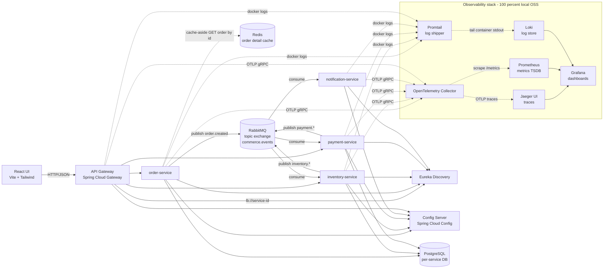
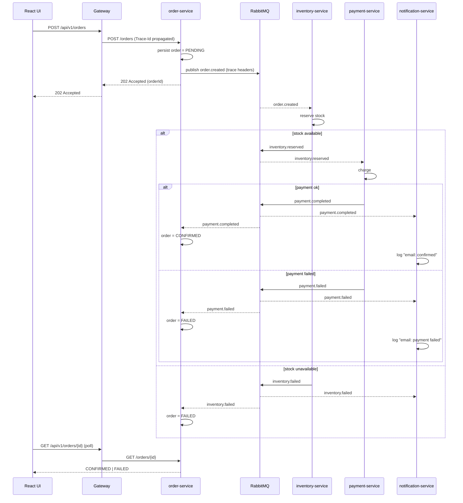
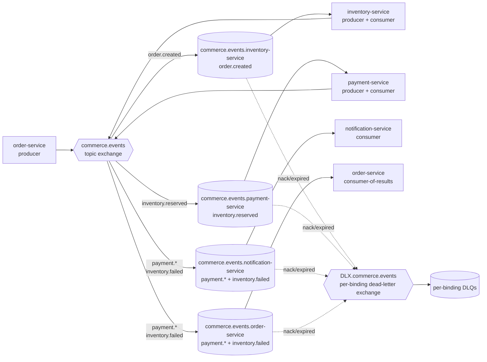

# Commerce POC — Architecture, Flows, and Code Sketches

> Companion document to the approved plan
> `~/.cursor/plans/springboot309_microservices_poc_*.plan.md`.
>
> **Scope:** local Docker Compose POC. Spring Boot **3.0.9** (hard pin, EOL),
> Java **17**, Spring Cloud **2022.0.5**, RabbitMQ, Spring Cloud Config,
> Eureka, Spring Cloud Gateway, React UI.
>
> **Observability — 100% local OSS (Path B).** Apps emit telemetry via the
> **OpenTelemetry Java agent** (zero-code, vendor-neutral) to an
> **OpenTelemetry Collector**, which fans out to:
> - **Jaeger** — distributed traces UI.
> - **Prometheus + Grafana** — metrics scraping and dashboards.
> - **Loki + Promtail** — centralized logs (tailing Docker container stdout).
>
> The Collector is the only seam: a future swap to **SolarWinds Observability**
> (traces + metrics) and **Papertrail / SolarWinds Logs** is a one-config-block
> change in `otelcol.yaml` — no app, gateway, or Compose changes required.
>
> Code blocks below are **illustrative sketches**, not production-ready
> implementations. They exist to anchor decisions made in the plan.
>
> **Per-service notes:** [Order service](architecture/order-service.md) · [Inventory](architecture/inventory-service.md) · [Payment](architecture/payment-service.md) · [Notification](architecture/notification-service.md) · [Index](architecture/README.md) · **Observability concepts:** [observability-primer.md](observability-primer.md) · **Flows & edge cases:** [scenarios-and-edge-cases.md](scenarios-and-edge-cases.md)

---

## 1. High-level architecture



---

**Order detail cache (Redis):** See **[Redis cache — order detail reads](architecture/order-service.md#redis-cache-order-detail-reads)**.

---

## 2. End-to-end order flow (saga via choreography)



---

## 3. RabbitMQ topology



**Routing keys**

- `order.created`
- `inventory.reserved`, `inventory.failed`
- `payment.completed`, `payment.failed`

**Each queue:** `durable=true`, **per-binding DLQ** via
`autoBindDlq: true` + `republishToDlq: true`, `prefetch=10` and
`maxAttempts=3` configured under
`spring.cloud.stream.rabbit.bindings.*.consumer`, consumer-side
idempotency on `event.id`. Queue names follow the binder convention
`<destination>.<group>`.

---

## 4. Version matrix (locked)

- Java: **17** (LTS, required by Spring Boot 3.0.9)
- Spring Boot: **3.0.9** (EOL — POC only)
- Spring Cloud: **2022.0.5** (Kilburn; only train compatible with 3.0.x)
- Spring Cloud Gateway: **4.0.x** (reactive)
- Spring Cloud Netflix Eureka: **4.0.x**
- Spring Cloud Config: **4.0.x**
- Spring Cloud Stream: **4.0.4** + **RabbitMQ binder** (`spring-cloud-starter-stream-rabbit`)
- Spring AMQP **3.0.x** (transitive via the Stream RabbitMQ binder)
- Micrometer: **1.10.x** + Micrometer Tracing **1.0.x** (Boot-managed)
- PostgreSQL: **16** (Compose image `postgres:16`)
- RabbitMQ: **3.12** (with management plugin)
- React: **18** + Vite + TypeScript + Tailwind
- OpenTelemetry Java agent: **2.x** (vendor-neutral, OTLP exporter built-in)
- OpenTelemetry Collector (contrib): **0.96.0+**
- Jaeger all-in-one: **1.55** (accepts OTLP natively)
- Prometheus: **v2.51.0**
- Grafana: **10.4.x** (Loki + Prometheus + Jaeger data sources)
- Loki: **2.9.x** (`grafana/loki:2.9.5`) + Promtail **3.1.x** (`grafana/promtail:3.1.0`)

> Build tool: **Maven** in this doc (most common for multi-module Boot 3.0
> tutorials). Gradle Kotlin DSL works equally well; swap `pom.xml` for
> `build.gradle.kts` with the same coordinates.

---

## 5. Repository layout

```
commerce-poc/                   # logical root name; your clone directory may differ
  docker-compose.yml            # authoritative stack (repository root — not under infra/)
  pom.xml                       # parent BOM + module aggregator
  config-repo/                  # YAML configs served by Config Server
    application.yml
    order-service.yml
    inventory-service.yml
    payment-service.yml
    notification-service.yml
    api-gateway.yml
  services/
    commons/                    # shared events, metrics aspects, logback fragment
    config-server/
    discovery-server/
    api-gateway/
    order-service/
    inventory-service/
    payment-service/
    notification-service/
  web-ui/                       # React + Vite + TS + Tailwind
  infra/
    rabbitmq/rabbitmq.conf        # loopback_users.guest=false; topology from Stream binder
    postgres/init.sql
    otel/
      install-agent.sh            # downloads agent/opentelemetry-javaagent.jar (creates agent/)
      agent/                      # bind-mounted at /opt/otel on gateway + domain JVM services only
    observability/
      otel-collector-config.yaml
      prometheus.yml
      promtail-config.yaml
      loki-local-config.yaml      # mounted into the Loki container as its config file
      grafana/
        provisioning/datasources/datasources.yaml
        provisioning/dashboards/dashboards.yaml
        dashboards/*.json         # provisioned dashboards (bind-mounted read-only)
  docs/
    ARCHITECTURE.md
    architecture/                 # per-service deep dives
    runbook.md
    dashboards/                   # optional notes / exports (not required at runtime)
```

---

## 6. Parent POM (BOM + dependency management)

```xml
<project>
  <modelVersion>4.0.0</modelVersion>
  <groupId>com.example.commerce</groupId>
  <artifactId>commerce-poc-parent</artifactId>
  <version>0.1.0-SNAPSHOT</version>
  <packaging>pom</packaging>

  <parent>
    <groupId>org.springframework.boot</groupId>
    <artifactId>spring-boot-starter-parent</artifactId>
    <version>3.0.9</version>
    <relativePath/>
  </parent>

  <properties>
    <java.version>17</java.version>
    <spring-cloud.version>2022.0.5</spring-cloud.version>
  </properties>

  <dependencyManagement>
    <dependencies>
      <dependency>
        <groupId>org.springframework.cloud</groupId>
        <artifactId>spring-cloud-dependencies</artifactId>
        <version>${spring-cloud.version}</version>
        <type>pom</type>
        <scope>import</scope>
      </dependency>
    </dependencies>
  </dependencyManagement>

  <modules>
    <module>services/commons</module>
    <module>services/config-server</module>
    <module>services/discovery-server</module>
    <module>services/api-gateway</module>
    <module>services/order-service</module>
    <module>services/inventory-service</module>
    <module>services/payment-service</module>
    <module>services/notification-service</module>
  </modules>
</project>
```

---

## 7. Config Server

**Bootstrap class**

```java
package com.example.commerce.config;

import org.springframework.boot.SpringApplication;
import org.springframework.boot.autoconfigure.SpringBootApplication;
import org.springframework.cloud.config.server.EnableConfigServer;

@EnableConfigServer
@SpringBootApplication
public class ConfigServerApplication {
  public static void main(String[] args) {
    SpringApplication.run(ConfigServerApplication.class, args);
  }
}
```

**application.yml (config-server)**

```yaml
server:
  port: 8888

spring:
  application:
    name: config-server
  cloud:
    config:
      server:
        git:
          uri: file:///workspace/config-repo
          default-label: main
          clone-on-start: true
```

**Shared `config-repo/application.yml`**

```yaml
spring:
  rabbitmq:
    host: rabbitmq
    port: 5672
    username: ${RABBITMQ_USER}
    password: ${RABBITMQ_PASSWORD}
  cloud:
    stream:
      default:
        contentType: application/json
      bindings:
        commerce-events-out:
          destination: commerce.events
      rabbit:
        bindings:
          commerce-events-out:
            producer:
              exchangeType: topic
              declareExchange: true
              routingKeyExpression: "headers['eventRoutingKey']"

eureka:
  client:
    serviceUrl:
      defaultZone: http://discovery-server:8761/eureka/

management:
  endpoints:
    web:
      exposure:
        include: health,info,metrics,prometheus,refresh
  tracing:
    sampling:
      probability: 1.0
  metrics:
    tags:
      application: ${spring.application.name}
```

Each service uses (no legacy `bootstrap.yml` — Boot 3.0.x way):

```yaml
spring:
  config:
    import: "optional:configserver:http://config-server:8888"
  application:
    name: order-service
```

---

## 8. Eureka discovery server

```java
package com.example.commerce.discovery;

import org.springframework.boot.SpringApplication;
import org.springframework.boot.autoconfigure.SpringBootApplication;
import org.springframework.cloud.netflix.eureka.server.EnableEurekaServer;

@EnableEurekaServer
@SpringBootApplication
public class DiscoveryServerApplication {
  public static void main(String[] args) {
    SpringApplication.run(DiscoveryServerApplication.class, args);
  }
}
```

```yaml
server:
  port: 8761
eureka:
  client:
    register-with-eureka: false
    fetch-registry: false
```

---

## 9. API Gateway (Spring Cloud Gateway, reactive)

```yaml
server:
  port: 8080

spring:
  application:
    name: api-gateway
  cloud:
    gateway:
      discovery:
        locator:
          enabled: false
      default-filters:
        - AddRequestHeader=X-Source, web-ui
        - name: Retry
          args:
            retries: 5
            statuses: SERVICE_UNAVAILABLE,BAD_GATEWAY,GATEWAY_TIMEOUT
            methods: GET,HEAD,POST,PUT,DELETE,OPTIONS,PATCH
            backoff:
              firstBackoff: 50ms
              maxBackoff: 500ms
              factor: 2
              basedOnPreviousValue: false
      globalcors:
        cors-configurations:
          '[/**]':
            allowedOrigins: "http://localhost:5173"
            allowedMethods: "*"
            allowedHeaders: "*"
      routes:
        - id: orders
          uri: lb://order-service
          predicates:
            - Path=/api/v1/orders/**
          filters:
            - RewritePath=/api/v1/orders/(?<segment>.*), /orders/$\{segment}
        - id: inventory
          uri: lb://inventory-service
          predicates:
            - Path=/api/v1/inventory/**
          filters:
            - RewritePath=/api/v1/inventory/(?<segment>.*), /inventory/$\{segment}
```

---

## 10. Shared event contracts (`services/commons`)

Records keep DTOs immutable and Jackson-friendly on Boot 3.0.x.

```java
package com.example.commerce.commons.events;

import java.time.Instant;
import java.util.UUID;

public sealed interface DomainEvent
    permits OrderCreated, InventoryReserved, InventoryFailed,
            PaymentCompleted, PaymentFailed {

  UUID eventId();
  UUID orderId();
  Instant occurredAt();
  String routingKey();
}

public record OrderCreated(
    UUID eventId, UUID orderId, String customerEmail,
    java.util.List<OrderLine> lines, Instant occurredAt) implements DomainEvent {
  public String routingKey() { return "order.created"; }
}

public record OrderLine(String sku, int quantity, java.math.BigDecimal unitPrice) {}

public record InventoryReserved(
    UUID eventId, UUID orderId, Instant occurredAt) implements DomainEvent {
  public String routingKey() { return "inventory.reserved"; }
}

public record InventoryFailed(
    UUID eventId, UUID orderId, String reason, Instant occurredAt) implements DomainEvent {
  public String routingKey() { return "inventory.failed"; }
}

public record PaymentCompleted(
    UUID eventId, UUID orderId, String transactionId, Instant occurredAt) implements DomainEvent {
  public String routingKey() { return "payment.completed"; }
}

public record PaymentFailed(
    UUID eventId, UUID orderId, String reason, Instant occurredAt) implements DomainEvent {
  public String routingKey() { return "payment.failed"; }
}
```

---

## 11. RabbitMQ topology — managed by the Stream binder

With Spring Cloud Stream 4.x there are **no `@Bean` declarations for
exchanges, queues, or bindings**. The RabbitMQ binder reads the
`spring.cloud.stream.bindings.*` properties at startup and provisions
everything:

- The shared **producer** output binding `commerce-events-out` (declared
  in the shared `config-repo/application.yml` in section 7) declares the
  topic exchange `commerce.events`.
- Each **consumer** binding declares a queue named
  `<destination>.<group>` and binds it to the exchange with a routing
  key — e.g. `commerce.events.inventory-service` bound to
  `commerce.events` with routing key `order.created`.
- `consumer.autoBindDlq: true` makes the binder also create
  `<destination>.<group>.dlq` and the dead-letter wiring **per
  binding**, so a poison message in one service does not block any other.

Only the routing-key constants live in `services/commons`:

```java
package com.example.commerce.commons.amqp;

public final class EventChannels {
  public static final String OUTPUT_BINDING       = "commerce-events-out";
  public static final String ROUTING_KEY_HEADER   = "eventRoutingKey";
  private EventChannels() {}
}
```

Per-service `application.yml` then declares only the bindings that
service consumes (full examples: [inventory-service](architecture/inventory-service.md), [payment-service](architecture/payment-service.md), [notification-service](architecture/notification-service.md)).

---

## 12. Order service — controller, producer, persistence

Full detail (REST, caching, metrics, Stream producers and order-status consumers): **[architecture/order-service.md](architecture/order-service.md)**.

---

## 13. Inventory service — Stream Consumer with idempotency

Reservation workflow, binder YAML, DLQ behavior: **[architecture/inventory-service.md](architecture/inventory-service.md)**.

---

## 14. Payment service — Stream Consumer sketch

Charge flow and bindings: **[architecture/payment-service.md](architecture/payment-service.md)**.

---

## 15. Notification service — terminal Stream Consumers

Typed terminal consumers and shared queue-group patterns: **[architecture/notification-service.md](architecture/notification-service.md)**.

---

## 16. Observability — traces and metrics via the OpenTelemetry Collector

Every Spring Boot service runs with the **OpenTelemetry Java agent**
(`-javaagent:/opt/otel/opentelemetry-javaagent.jar`) and exports OTLP
gRPC to a single **OTel Collector**. The Collector fans out to **Jaeger**
(traces) and **Prometheus** (metrics, scraped via the Collector's
Prometheus exporter). Grafana consumes **Prometheus**, **Jaeger**, and
**Loki** as data sources (see `infra/observability/grafana/provisioning/datasources/datasources.yaml`).

**Provisioned dashboards** (JSON under `infra/observability/grafana/dashboards/`, bind-mounted into Grafana):

- **Commerce — Orders** (`commerce-orders.json`) — saga counters, HTTP rates, Observation timers, Redis order-detail cache hits/misses, order lookup found/not-found counters.
- **Commerce — ERROR logs** (`commerce-log-errors.json`) — ERROR-level JSON logs across Compose services via Loki.

Ad-hoc **logs** and **traces** use **Grafana → Explore** (Loki / Jaeger) or the **Jaeger** UI directly.

The OTel agent auto-instruments Spring MVC, WebFlux, JDBC, HTTP client,
and **Spring AMQP** (producer + consumer), so RabbitMQ trace context
propagates through message headers without any application code.

**Shared OTLP env** (`docker-compose.yml` **`x-app-env`** anchor), repeated on
each JVM service with **`OTEL_SERVICE_NAME`** overridden per container:

```yaml
JAVA_TOOL_OPTIONS: "-javaagent:/opt/otel/opentelemetry-javaagent.jar"
OTEL_SERVICE_NAME: "order-service"
OTEL_EXPORTER_OTLP_ENDPOINT: "http://otel-collector:4317"
OTEL_EXPORTER_OTLP_PROTOCOL: "grpc"
OTEL_TRACES_EXPORTER: "otlp"
OTEL_METRICS_EXPORTER: "otlp"
OTEL_LOGS_EXPORTER: "none"            # logs ship via Promtail in this POC
OTEL_RESOURCE_ATTRIBUTES: "service.namespace=commerce,deployment.environment=local"
OTEL_TRACES_SAMPLER: "parentbased_always_on"
OTEL_INSTRUMENTATION_SPRING_INTEGRATION_ENABLED: "true"
```

**Collector config — `infra/observability/otel-collector-config.yaml`:**

```yaml
receivers:
  otlp:
    protocols:
      grpc:
        endpoint: 0.0.0.0:4317
      http:
        endpoint: 0.0.0.0:4318

processors:
  batch: {}
  resourcedetection/docker:
    detectors: [env, system]

exporters:
  # Traces -> Jaeger via OTLP gRPC (Jaeger 1.50+ accepts OTLP natively)
  otlp/jaeger:
    endpoint: jaeger:4317
    tls:
      insecure: true

  # Metrics -> Prometheus pulls from this endpoint on the Collector
  prometheus:
    endpoint: 0.0.0.0:9464
    resource_to_telemetry_conversion:
      enabled: true

  # SolarWinds path - leave commented until ready to migrate (section 22).
  # otlp/solarwinds:
  #   endpoint: ${env:SW_OTEL_ENDPOINT}
  #   headers:
  #     authorization: "Bearer ${env:SW_API_TOKEN}"

service:
  pipelines:
    traces:
      receivers:  [otlp]
      processors: [batch, resourcedetection/docker]
      exporters:  [otlp/jaeger]
      # exporters: [otlp/jaeger, otlp/solarwinds]   # hybrid mode (section 22)
    metrics:
      receivers:  [otlp]
      processors: [batch, resourcedetection/docker]
      exporters:  [prometheus]
      # exporters: [prometheus, otlp/solarwinds]
```

**Prometheus scrape config — `infra/observability/prometheus.yml`:**

```yaml
global:
  scrape_interval: 15s

scrape_configs:
  - job_name: otel-collector
    static_configs:
      - targets: ["otel-collector:9464"]

  - job_name: spring-actuator
    metrics_path: /actuator/prometheus
    static_configs:
      - targets:
          - api-gateway:8080
          - order-service:8080
          - inventory-service:8080
          - payment-service:8080
          - notification-service:8080
```

> Two metric paths coexist: the OTel agent ships JVM/HTTP/AMQP metrics
> via OTLP, and Spring Boot Actuator exposes `/actuator/prometheus` for
> direct Prometheus scrape. Pick one path in production; both are kept
> here so dashboards still work if either pipeline is disabled.

**Custom business metrics** via Micrometer — unchanged regardless of
backend. Examples from the services: `orders.placed.count`,
`orders.confirmed.count`, `orders.failed.count` (tagged by reason),
`inventory.reserved.count`, `inventory.failed.count`,
`payments.successful.count`, `payments.failed.count`,
`notifications.sent.count` (tagged by notification type).

**`@CommerceMetered`** (commons aspect + Observation registry) adds named
operations and outcome counters such as
`commerce_order_service_order_detail_cache_total{result="hit|miss"}` and
`commerce_order_service_order_lookup_total{result="found|not_found"}`, plus
timer series `commerce_*_seconds_*` for annotated flows.

**Manual span via Micrometer Tracing** — unchanged regardless of backend:

```java
private final io.micrometer.tracing.Tracer tracer;

void reserve(List<OrderLine> lines) {
  var span = tracer.nextSpan().name("inventory.reserve").start();
  try (var ws = tracer.withSpan(span)) {
    stock.reserveAll(lines);
  } catch (RuntimeException ex) {
    span.error(ex);
    throw ex;
  } finally {
    span.end();
  }
}
```

---

## 17. Observability — logs via Promtail and Loki

Apps log to **stdout** (Docker JSON file driver). **Promtail** tails
`/var/lib/docker/containers/*/*-json.log`, attaches low-cardinality Docker
labels (**`service`**, **`container`**), and pushes to **Loki**. Trace and span
ids stay **inside** each log line as structured JSON fields — they are **not**
Promtail/Loki labels (avoiding cardinality blowups from every span).

**Logback** (`services/commons/src/main/resources/logback-spring.xml`) uses
**`LoggingEventCompositeJsonEncoder`**: one JSON object per line with
`timestamp`, **`level`**, **`logger`**, **`message`**, explicit JSON fields for
**`service_name`** (from `spring.application.name`), **`traceId`** / **`spanId`**
(from MDC), remaining MDC keys (e.g. **`orderId`** when set), and
**`stack_trace`** on errors (shortened stack trace). Micrometer Tracing and the
OTel Java agent populate `traceId` / `spanId` in MDC.

The checked-in XML uses a small **`LoggingEventPatternJsonProvider`** for the
static shape above plus **`logLevel`**, **`loggerName`**, **`message`**, **`mdc`**
(with trace keys excluded from the MDC block because they are duplicated in the
pattern), and **`stackTrace`** — refer to the repo file rather than duplicating
the full encoder here.

**Promtail scrape config — `infra/observability/promtail-config.yaml`:**

```yaml
server:
  http_listen_port: 9080

positions:
  filename: /tmp/positions.yaml

clients:
  - url: http://loki:3100/loki/api/v1/push

scrape_configs:
  - job_name: docker
    docker_sd_configs:
      - host: unix:///var/run/docker.sock
        refresh_interval: 5s
    relabel_configs:
      - source_labels: ['__meta_docker_container_label_com_docker_compose_service']
        target_label: 'service'
      - source_labels: ['__meta_docker_container_name']
        regex: '/(.*)'
        target_label: 'container'
```

In **Grafana Explore → Loki**, parse JSON then filter, for example:
`{service=~".+"} | json | traceId="<jaeger-trace-id>"`. Derived fields on the
Loki datasource regex-match `"traceId"` / `"spanId"` / `"orderId"` in the raw
JSON line for quick jumps and copies. **Jaeger → Related logs** uses a
substring filter (`|=`) so the trace id matches inside JSON without Loki labels.

Datasource wiring lives under
`infra/observability/grafana/provisioning/datasources/datasources.yaml`.

**Alternative path — OTLP logs.** Flip `OTEL_LOGS_EXPORTER=otlp` and add
the OpenTelemetry Logback appender
(`opentelemetry-logback-appender-1.0`). Logs then flow through the same
Collector pipeline as traces and metrics, which means swapping backends
becomes a one-exporter change in `otelcol.yaml` (see section 22). The
Promtail path is kept here because it requires zero app changes and
mirrors the eventual Papertrail shape (syslog/HTTPS shipper at the
perimeter).

---

## 18. Docker Compose (excerpt)

The **authoritative** compose file is **`docker-compose.yml` at the repository
root**. It includes **Redis** (order-detail cache for `order-service`), the
**web-ui** container, **Loki** config bind-mounted from
`infra/observability/loki-local-config.yaml`, **Grafana** dashboard bind-mounts,
and health-based **`depends_on`** wiring (for example the gateway waits on
healthy domain services). The YAML below is a shortened illustration — diff it
against the real file when in doubt.

```yaml
version: "3.9"

networks:
  commerce-net: {}

volumes:
  pgdata: {}
  rabbitdata: {}
  redisdata: {}
  prometheus_data: {}
  grafana_data: {}
  loki_data: {}

x-app-env: &otel-env
  JAVA_TOOL_OPTIONS: "-javaagent:/opt/otel/opentelemetry-javaagent.jar"
  OTEL_EXPORTER_OTLP_ENDPOINT: "http://otel-collector:4317"
  OTEL_EXPORTER_OTLP_PROTOCOL: "grpc"
  OTEL_TRACES_EXPORTER: "otlp"
  OTEL_METRICS_EXPORTER: "otlp"
  OTEL_LOGS_EXPORTER: "none"
  OTEL_RESOURCE_ATTRIBUTES: "service.namespace=commerce,deployment.environment=local"
  OTEL_TRACES_SAMPLER: "parentbased_always_on"
  OTEL_INSTRUMENTATION_SPRING_INTEGRATION_ENABLED: "true"

services:
  postgres:
    image: postgres:16
    environment:
      POSTGRES_USER: ${POSTGRES_USER}
      POSTGRES_PASSWORD: ${POSTGRES_PASSWORD}
      POSTGRES_MULTIPLE_DATABASES: orders,inventory,payments
    volumes:
      - pgdata:/var/lib/postgresql/data
      - ./infra/postgres/init.sql:/docker-entrypoint-initdb.d/init.sql:ro
    networks: [commerce-net]
    healthcheck:
      test: ["CMD-SHELL", "pg_isready -U $$POSTGRES_USER"]
      interval: 5s
      retries: 10

  redis:
    image: redis:7-alpine
    command: ["redis-server", "--appendonly", "yes"]
    volumes:
      - redisdata:/data
    networks: [commerce-net]
    healthcheck:
      test: ["CMD", "redis-cli", "ping"]
      interval: 5s
      timeout: 3s
      retries: 8

  rabbitmq:
    image: rabbitmq:3.12-management
    environment:
      RABBITMQ_DEFAULT_USER: ${RABBITMQ_USER}
      RABBITMQ_DEFAULT_PASS: ${RABBITMQ_PASSWORD}
    volumes:
      - rabbitdata:/var/lib/rabbitmq
      - ./infra/rabbitmq/rabbitmq.conf:/etc/rabbitmq/rabbitmq.conf:ro
    ports: ["5672:5672", "15672:15672"]
    networks: [commerce-net]
    healthcheck:
      test: ["CMD", "rabbitmq-diagnostics", "ping"]
      interval: 10s
      retries: 6

  # ---------- Observability stack (Path B) ----------

  otel-collector:
    image: otel/opentelemetry-collector-contrib:0.96.0
    command: ["--config=/etc/otelcol/config.yaml"]
    volumes:
      - ./infra/observability/otel-collector-config.yaml:/etc/otelcol/config.yaml:ro
    ports:
      - "4317:4317"     # OTLP gRPC
      - "4318:4318"     # OTLP HTTP
      - "9464:9464"     # Prometheus exporter
    networks: [commerce-net]

  jaeger:
    image: jaegertracing/all-in-one:1.55
    environment:
      COLLECTOR_OTLP_ENABLED: "true"
    ports:
      - "16686:16686"   # UI
    networks: [commerce-net]

  prometheus:
    image: prom/prometheus:v2.51.0
    volumes:
      - ./infra/observability/prometheus.yml:/etc/prometheus/prometheus.yml:ro
      - prometheus_data:/prometheus
    ports: ["9090:9090"]
    networks: [commerce-net]

  loki:
    image: grafana/loki:2.9.5
    command: ["-config.file=/etc/loki/local-config.yaml"]
    volumes:
      - ./infra/observability/loki-local-config.yaml:/etc/loki/local-config.yaml:ro
      - loki_data:/loki
    ports: ["3100:3100"]
    networks: [commerce-net]

  promtail:
    image: grafana/promtail:3.1.0
    volumes:
      - /var/run/docker.sock:/var/run/docker.sock:ro
      - /var/lib/docker/containers:/var/lib/docker/containers:ro
      - ./infra/observability/promtail-config.yaml:/etc/promtail/config.yaml:ro
    command: ["-config.file=/etc/promtail/config.yaml"]
    depends_on: [loki]
    networks: [commerce-net]

  grafana:
    image: grafana/grafana:10.4.0
    environment:
      GF_SECURITY_ADMIN_PASSWORD: ${GRAFANA_PASSWORD}
    volumes:
      - ./infra/observability/grafana/provisioning:/etc/grafana/provisioning:ro
      - ./infra/observability/grafana/dashboards:/var/lib/grafana/dashboards:ro
      - grafana_data:/var/lib/grafana
    ports: ["3000:3000"]
    depends_on: [prometheus, loki, jaeger]
    networks: [commerce-net]

  # ---------- Platform services ----------

  config-server:
    build: ./services/config-server
    ports: ["8888:8888"]
    volumes:
      - ./config-repo:/workspace/config-repo
    networks: [commerce-net]
    healthcheck:
      test: ["CMD", "curl", "-fsS", "http://localhost:8888/actuator/health"]
      interval: 10s
      retries: 12

  discovery-server:
    build: ./services/discovery-server
    ports: ["8761:8761"]
    depends_on:
      config-server: { condition: service_healthy }
    networks: [commerce-net]

  # ---------- Business services + gateway ----------

  api-gateway:
    build: ./services/api-gateway
    ports: ["8080:8080"]
    environment:
      <<: *otel-env
      OTEL_SERVICE_NAME: "api-gateway"
    volumes:
      - ./infra/otel/agent:/opt/otel:ro
    depends_on:
      config-server:       { condition: service_healthy }
      discovery-server:    { condition: service_started }
      otel-collector:      { condition: service_started }
      order-service:       { condition: service_healthy }
      inventory-service:   { condition: service_healthy }
      payment-service:     { condition: service_healthy }
    networks: [commerce-net]

  order-service:
    build: ./services/order-service
    environment:
      <<: *otel-env
      OTEL_SERVICE_NAME: "order-service"
      POSTGRES_USER: ${POSTGRES_USER}
      POSTGRES_PASSWORD: ${POSTGRES_PASSWORD}
      RABBITMQ_USER:     "${RABBITMQ_USER}"
      RABBITMQ_PASSWORD: "${RABBITMQ_PASSWORD}"
    volumes:
      - ./infra/otel/agent:/opt/otel:ro
    depends_on:
      postgres:         { condition: service_healthy }
      rabbitmq:         { condition: service_healthy }
      redis:            { condition: service_healthy }
      config-server:    { condition: service_healthy }
      discovery-server: { condition: service_started }
      otel-collector:   { condition: service_started }
    networks: [commerce-net]

  # inventory-service, payment-service, notification-service: same shape;
  # change only OTEL_SERVICE_NAME and depends_on (no Redis).
```

`.env` (gitignored) supplies `POSTGRES_*`, `RABBITMQ_*`,
`GRAFANA_PASSWORD`. No vendor secrets are needed in Path B.

Place the OpenTelemetry Java agent at
`infra/otel/agent/opentelemetry-javaagent.jar` (downloaded by
`infra/otel/install-agent.sh`).

---

## 19. React UI — Axios client + place-order sketch

`src/lib/api.ts`

```ts
import axios from "axios";

export const api = axios.create({
  baseURL: import.meta.env.VITE_API_BASE_URL,   // http://localhost:8080
  timeout: 8000,
  headers: { "Content-Type": "application/json" },
});

export type PlaceOrderRequest = {
  customerEmail: string;
  lines: { sku: string; quantity: number; unitPrice: number }[];
};

export type OrderResponse = { id: string; status: "PENDING" | "CONFIRMED" | "FAILED" };

export async function placeOrder(req: PlaceOrderRequest) {
  const { data } = await api.post<OrderResponse>("/api/v1/orders", req);
  return data;
}

export async function getOrder(id: string) {
  const { data } = await api.get<OrderResponse>(`/api/v1/orders/${id}`);
  return data;
}
```

`src/pages/CheckoutPage.tsx` (essential bits only)

```tsx
import { useMutation, useQuery } from "@tanstack/react-query";
import { useState } from "react";
import { placeOrder, getOrder } from "../lib/api";

export default function CheckoutPage() {
  const [orderId, setOrderId] = useState<string | null>(null);

  const place = useMutation({
    mutationFn: placeOrder,
    onSuccess: (res) => setOrderId(res.id),
  });

  const status = useQuery({
    queryKey: ["order", orderId],
    queryFn: () => getOrder(orderId!),
    enabled: Boolean(orderId),
    refetchInterval: (q) =>
      q.state.data?.status === "PENDING" ? 1500 : false,
  });

  return (
    <main className="mx-auto max-w-xl p-6 space-y-4">
      <h1 className="text-2xl font-semibold">Checkout</h1>

      <button
        type="button"
        className="rounded-md bg-slate-900 px-4 py-2 text-white disabled:opacity-50"
        disabled={place.isPending}
        onClick={() =>
          place.mutate({
            customerEmail: "demo@example.com",
            lines: [{ sku: "SKU-1", quantity: 1, unitPrice: 19.99 }],
          })
        }
      >
        {place.isPending ? "Placing..." : "Place order"}
      </button>

      {orderId && (
        <p aria-live="polite" className="text-sm text-slate-700">
          Order <code>{orderId}</code> status:{" "}
          <strong>{status.data?.status ?? "..."}</strong>
        </p>
      )}
    </main>
  );
}
```

---

## 20. End-to-end smoke test (what "done" looks like)

1. From the **repository root**, `docker compose up -d` brings up postgres,
   rabbitmq, **redis**, the observability stack (otel-collector, jaeger,
   prometheus, grafana, loki, promtail), config, eureka, gateway, **web-ui**,
   and all JVM services. Containers settle to `healthy` / running after startup.
2. **RabbitMQ UI** at `http://localhost:15672` shows the exchange
   `commerce.events`, four binder-created queues
   (`commerce.events.<service>`), and their per-binding DLQs.
3. **Eureka** at `http://localhost:8761` lists all four business services
   plus the gateway.
4. **React UI** at `http://localhost:5173` places an order.
5. **Jaeger UI** at `http://localhost:16686` (try service **`api-gateway`** or
   **`order-service`**) shows **trace** continuity for the saga:
   **`api-gateway` → `order-service` → RabbitMQ → `inventory-service` → … →
   `payment-service` → … → `notification-service`**. The static **`web-ui`**
   container is not OTel-instrumented; correlation starts at the gateway/backend.
6. **Grafana** at `http://localhost:3000` (login `admin` /
   `${GRAFANA_PASSWORD}`): provisioned dashboards **Commerce — Orders** and
   **Commerce — ERROR logs** should load under **Dashboards**. Expect, among
   others, `orders_placed_count_total`, `orders_confirmed_count_total`,
   `inventory_reserved_count_total`, order-detail cache counters
   (`commerce_order_service_order_detail_cache_total`), lookup counters
   (`commerce_order_service_order_lookup_total`), plus Observation timer series
   (`commerce_*_seconds_*`) and JVM / HTTP metrics from the **`/actuator/prometheus`**
   scrape (and/or OTLP-derived series from the Collector).
7. **Grafana Explore → Loki** with LogQL such as
   `{service=~".+"} | json | traceId="<id-from-step-5>"` returns log lines from
   every service involved. Derived-field **TraceID** on a row opens the matching
   Jaeger trace; Jaeger **Related logs** uses a line filter on the same id.

---

## 21. Known POC limitations (must call out before any non-POC use)

- **Spring Boot 3.0.9 is EOL** — no security patches upstream. Upgrade
  path is Boot 3.3.x or 3.4.x; both still target Spring Cloud's modern
  release trains. **Dynatrace POC** deliberately stays on **3.0.9**:
  **Dynatrace OneAgent** (`docker-compose.dynatrace-poc.yml`, Linux) for **Java PurePath traces** and infra, **Micrometer** for metrics via
  **`config-repo/application-dynatrace.yml`** — see **[DYNATRACE-POC.md](DYNATRACE-POC.md)**.
- **No authentication** — the gateway is open and Grafana ships with the
  default admin. Add Keycloak/Cognito at the gateway and tighten Grafana
  before exposing anything beyond `localhost`.
- **Choreography saga only** — no orchestrator, no compensating actions
  beyond status updates. Multi-step rollback would need a saga
  coordinator or outbox pattern.
- **No outbox pattern** — `StreamBridge.send(...)` and the DB write
  share a transaction but there is no durable outbox if RabbitMQ is
  down at publish time. Acceptable for POC, not for prod.
- **No retention / HA on the observability stack** — Loki runs in
  single-binary filesystem mode, Prometheus has no remote-write, Jaeger
  is `all-in-one` (in-memory). Fine for POC; production should use
  Tempo/Mimir or migrate to SolarWinds (section 22).
- **One Postgres with multiple logical databases** — fine for POC,
  simpler than running three Postgres containers; rework before prod.

---

## 22. Migration path — swap OSS backends for SolarWinds Observability and Papertrail

Because every service speaks **OTLP** and ships **stdout** logs, the
migration to **SolarWinds Observability** (traces + metrics) and
**Papertrail / SolarWinds Logs** (logs) happens **in `otelcol.yaml` and
one log-shipper container** — not in application code.

### 22.1 Prerequisites

- **SolarWinds Observability** account (free trial works) with:
  - **API ingestion token** -> `SW_API_TOKEN`.
  - **OTLP endpoint** for the tenant region -> `SW_OTEL_ENDPOINT`
    (e.g. `otel.collector.na-01.cloud.solarwinds.com:443`).
- **Papertrail** account (free tier works) with:
  - **Syslog host + port** -> `PAPERTRAIL_HOST`, `PAPERTRAIL_PORT`
    (e.g. `logsN.papertrailapp.com:NNNNN`).
- All secrets stored only in `.env` (gitignored). Add a placeholder
  `.env.example` to the repo without values. Never commit tokens.

### 22.2 Three migration modes

Pick one based on goal:

- **Mode A — Hybrid (recommended first step).** Keep all OSS backends;
  *also* fan out to SolarWinds and Papertrail. Lets you compare
  results side-by-side and roll back instantly.
- **Mode B — SolarWinds + Papertrail only.** Stop running
  Jaeger / Prometheus / Loki / Promtail containers locally.
- **Mode C — OSS for the laptop, SaaS for shared envs.** Keep the OSS
  stack for local dev; enable SolarWinds and Papertrail only when the
  stack runs on a shared host or CI.

### 22.3 Steps — traces and metrics

1. **Add the SolarWinds exporter** to
   `infra/observability/otel-collector-config.yaml`:

   ```yaml
   exporters:
     otlp/solarwinds:
       endpoint: ${env:SW_OTEL_ENDPOINT}
       headers:
         authorization: "Bearer ${env:SW_API_TOKEN}"
       tls:
         insecure: false
   ```

2. **Inject env into the Collector** in `docker-compose.yml`:

   ```yaml
   otel-collector:
     environment:
       SW_OTEL_ENDPOINT: ${SW_OTEL_ENDPOINT}
       SW_API_TOKEN:     ${SW_API_TOKEN}
   ```

3. **Add it to the pipelines** — append for Mode A, replace for Mode B:

   ```yaml
   service:
     pipelines:
       traces:
         exporters: [otlp/jaeger, otlp/solarwinds]    # Mode A
         # exporters: [otlp/solarwinds]               # Mode B
       metrics:
         exporters: [prometheus, otlp/solarwinds]     # Mode A
         # exporters: [otlp/solarwinds]               # Mode B
   ```

4. **Service metadata** is already correct — `OTEL_SERVICE_NAME` and
   `OTEL_RESOURCE_ATTRIBUTES` from section 18 are vendor-neutral.

5. **Restart only the Collector** — apps stay running:

   ```bash
   docker compose up -d --no-deps --force-recreate otel-collector
   ```

6. **Verify in SolarWinds Observability:**
   - Service map shows `api-gateway`, `order-service`,
     `inventory-service`, `payment-service`, `notification-service`
     linked by HTTP and RabbitMQ spans (Spring Cloud Stream binder
     instrumentation propagates `traceparent` headers automatically).
   - Metrics Explorer finds `orders_placed_count_total` and JVM metrics
     tagged with `service.name`.

7. **(Mode B only) Decommission OSS metric / trace backends:**

   ```bash
   docker compose rm -sfv jaeger prometheus
   ```

   Remove the `otlp/jaeger` and `prometheus` exporters from
   `otelcol.yaml`.

### 22.4 Steps — logs to Papertrail

Pick one option.

**Option 1 — Replace Promtail with `logspout` (simplest,
Papertrail-recommended).**

1. Add a `logspout` service to Compose:

   ```yaml
   logspout:
     image: gliderlabs/logspout:v3.2.14
     command: "syslog+tls://${PAPERTRAIL_HOST}:${PAPERTRAIL_PORT}"
     volumes:
       - /var/run/docker.sock:/var/run/docker.sock:ro
     networks: [commerce-net]
   ```

2. Remove Promtail (and Loki if you don't need it anymore):

   ```bash
   docker compose rm -sfv promtail loki
   ```

3. Logs now ship from every container's stdout straight to Papertrail.
   Trace IDs remain in each **JSON** line (`traceId` field); search Papertrail
   by that field or plain substring.

**Option 2 — Add a Logback `SyslogAppender` (per-app, more control).**

1. Add to `services/commons/src/main/resources/logback-spring.xml`:

   ```xml
   <appender name="PAPERTRAIL" class="ch.qos.logback.classic.net.SyslogAppender">
     <syslogHost>${PAPERTRAIL_HOST}</syslogHost>
     <port>${PAPERTRAIL_PORT}</port>
     <facility>USER</facility>
     <suffixPattern>${appName} %X{traceId:-} %X{spanId:-} %-5level %logger - %msg</suffixPattern>
   </appender>

   <root level="INFO">
     <appender-ref ref="CONSOLE"/>
     <appender-ref ref="PAPERTRAIL"/>
   </root>
   ```

2. Pass `PAPERTRAIL_HOST` and `PAPERTRAIL_PORT` into each service in
   Compose.
3. Plain syslog is unencrypted. For TLS add an `stunnel` sidecar
   pointing at Papertrail's TLS endpoint, or switch to
   `logback-syslog4j` with `SSLTCPNetSyslogConfig`.

**Option 3 — Future-proof: ship logs via OTLP, fan out at the
Collector.**

1. In each service, add the OpenTelemetry Logback appender
   (`io.opentelemetry.instrumentation:opentelemetry-logback-appender-1.0`).
2. Flip `OTEL_LOGS_EXPORTER=otlp` and add `loki` and / or
   `otlp/solarwinds` exporters in `otelcol.yaml`'s `logs` pipeline.
3. Papertrail and SolarWinds Logs both become just another exporter
   choice — same shape as the trace migration above.

### 22.5 Rollback

Because the migration is exporter-side, rollback is a single restart:

```bash
git checkout -- infra/observability/otel-collector-config.yaml docker-compose.yml
docker compose up -d --no-deps --force-recreate otel-collector logspout
```

No application image rebuild is required.

### 22.6 Things that change vs Path B

- **Cost.** SolarWinds and Papertrail bill by ingest / retention.
  Sample appropriately in non-dev envs:
  `OTEL_TRACES_SAMPLER=parentbased_traceidratio`,
  `OTEL_TRACES_SAMPLER_ARG=0.1`.
- **Network egress.** Telemetry leaves the machine. Plan for ~MB / min
  per service under POC load.
- **PII.** Re-read `~/.cursor/rules/security.mdc` before logs leave the
  laptop. No PII in logs is mandatory.
- **Auth headers.** Store `SW_API_TOKEN` and `PAPERTRAIL_*` in `.env` or
  a secret manager. Never commit. Document a rotation cadence.
- **Dashboards.** Recreate the Grafana panels in SolarWinds Observability
  or import their equivalent SWO templates.

### 22.7 Migration checklist

- [ ] Trial accounts created (SolarWinds Observability + Papertrail).
- [ ] `SW_OTEL_ENDPOINT`, `SW_API_TOKEN`, `PAPERTRAIL_HOST`,
      `PAPERTRAIL_PORT` added to `.env` (and an `.env.example`
      committed without values).
- [ ] `otelcol.yaml` updated with `otlp/solarwinds` exporter and added
      to the `traces` + `metrics` pipelines.
- [ ] `logspout` added to Compose (or Logback `SyslogAppender` added to
      `commons`).
- [ ] Collector + log shipper restarted; apps untouched.
- [ ] Smoke test (section 20) re-run against the SolarWinds and
      Papertrail UIs.
- [ ] OSS backends decommissioned (Mode B) or kept side-by-side (Mode
      A).
- [ ] Sampling configured for non-local environments.
- [ ] Token rotation cadence documented.
