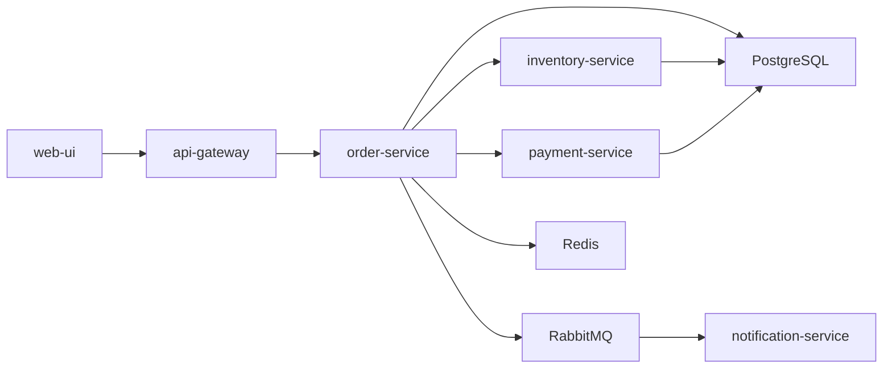
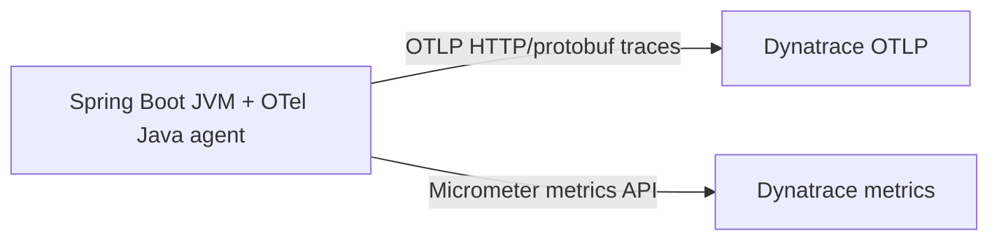

# Architecture

## System overview

This project is a Spring Boot microservices demo composed of:

- `api-gateway`
- `order-service`
- `inventory-service`
- `payment-service`
- `notification-service`
- `config-server`
- `discovery-server`
- PostgreSQL, RabbitMQ, Redis, and the React `web-ui`

The maintained runtime is defined in a single file: [`docker-compose.yml`](../docker-compose.yml).

## Observability architecture

The repository now maintains a **Dynatrace-only** observability path.

### Traces

Each JVM service loads the OpenTelemetry Java agent from `./infra/otel/agent` and exports traces directly to Dynatrace using:

- `OTEL_EXPORTER_OTLP_ENDPOINT`
- `OTEL_EXPORTER_OTLP_PROTOCOL=http/protobuf`
- `OTEL_EXPORTER_OTLP_HEADERS=Authorization=Api-Token ...`
- per-service `OTEL_SERVICE_NAME`

### Metrics

Application metrics use Micrometer with `micrometer-registry-dynatrace` and the `dynatrace` Spring profile served by Config Server.

### Removed from the maintained scope

The project no longer maintains a local observability stack. The following components were removed because the chosen operating model is direct export to Dynatrace:

- OpenTelemetry Collector
- Jaeger
- Prometheus
- Loki
- Promtail
- Grafana

## Why direct export

Direct export keeps the demo smaller and easier to maintain. A collector can be reintroduced later only if the project needs batching, transformation, redaction, fan-out, or backend independence.

## Important limitation

The project remains on Spring Boot `3.0.9`, so traces are exported through the OpenTelemetry Java agent rather than Spring Boot's newer native OTLP tracing support.
