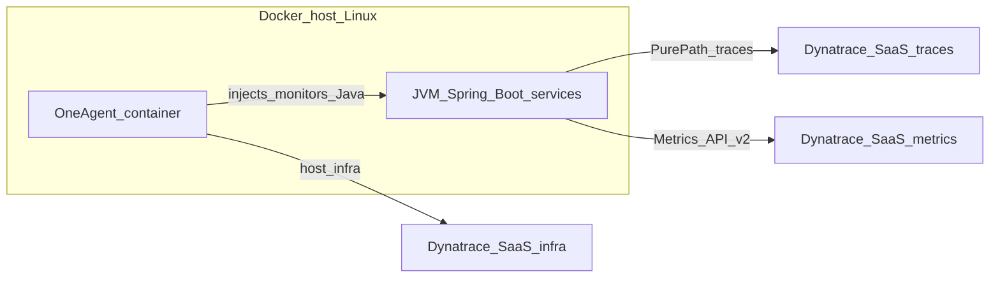

# Dynatrace POC guide (Spring Boot 3.0.9 — OneAgent Java, metrics, Docker Compose)

This document describes a **Dynatrace-only validation** path for **traceability-monitoring-spring-boot-3** while keeping **`spring-boot-starter-parent` 3.0.9** (same pin as the rest of the repo — **no Spring Boot upgrade** for this POC).

**Primary approach (this plan):**

| Layer | Role in this POC |
|--------|------------------|
| **Dynatrace OneAgent** | **Java code-level monitoring** (PurePath): OneAgent **instruments your JVMs** and sends **distributed traces / spans** to Dynatrace **without** the OpenTelemetry Java agent. The **`oneagent`** Compose service (**§6.1**) is required so OneAgent can install and attach to processes per [Dynatrace’s Docker model](https://docs.dynatrace.com/docs/ingest-from/setup-on-container-platforms/docker/set-up-dynatrace-oneagent-as-docker-container). |
| **Application metrics** | **`micrometer-registry-dynatrace`** + **`management.dynatrace.metrics.export.*`** in **`config-repo/application-dynatrace.yml`** (**§5.2**). See [Spring Boot 3.0.9 — Dynatrace metrics](https://docs.spring.io/spring-boot/docs/3.0.9/reference/html/actuator.html#actuator.metrics-export-dynatrace). |

### Planned stack (OneAgent-first)



1. **OneAgent** — **`docker-compose.dynatrace-poc.yml`** starts **`oneagent`** first (installer URL + **`InstallerDownload`** token in `.env`). After install, OneAgent **instruments Java** in monitored processes; **trace and span IDs** are created inside the **OneAgent / Dynatrace** sensor path and appear as **distributed traces** in the Dynatrace UI (not via `OTEL_*` OTLP from the app).
2. **Micrometer** — **application metrics** (custom meters, JVM, etc.) to the **Metrics ingest API** using **`DYNATRACE_API_TOKEN`** with scope **`metrics.ingest`** (**§5.2**). **`v2.enrich-with-dynatrace-metadata: true`** helps Dynatrace correlate series with **OneAgent** topology.

**Platform:** OneAgent-as-container uses **privileged** / **host network** and mounts **`/` → `/mnt/root`** so the installer deploys to the **real machine root** behind Docker (see [Dynatrace limitations](https://docs.dynatrace.com/docs/ingest-from/setup-on-container-platforms/docker/set-up-dynatrace-oneagent-as-docker-container#limitations)). On **Docker Desktop for Mac (Apple Silicon)**, that root is **Linux AArch64** — your **`ONEAGENT_INSTALLER_SCRIPT_URL` must use `arch=arm`** (Dynatrace “Linux ARM” / Deployment API), **not** `arch=x86`. **`arch=x86`** is only for **x86_64** Linux hosts. Mismatch produces **`architecture not supported: <AARCH64>`**. For the most predictable PurePaths, use **native Linux** (x86_64 or arm64 matching the installer you choose).

**Success criteria:** **Java services** show **PurePath / distributed traces** from **OneAgent**, **`commerce.poc*`** metrics from Micrometer, and **host/process** entities from OneAgent.

**Security:** never commit real tokens. Use a **gitignored** `.env` file and placeholders in `.env.example`.

### macOS (Docker Desktop) — running OneAgent for this POC

Dynatrace’s **OneAgent-as-container** flow targets **Linux** hosts; on a Mac you run it **inside Docker Desktop’s Linux VM**, not on macOS directly.

1. **Install / open [Docker Desktop](https://www.docker.com/products/docker-desktop/)** (current version). Ensure **Docker Engine** is running.
2. **Privileged + host features:** the `oneagent` service uses **`privileged: true`**, **`pid: host`**, **`network_mode: host`**, and mounts **`/` → `/mnt/root`**. Docker Desktop must be allowed to run that (default on Mac; corporate policies sometimes block it).
3. **Installer URL (`ONEAGENT_INSTALLER_SCRIPT_URL`) — match the VM’s CPU, not your Mac’s marketing name:**
   - **Apple Silicon (M1/M2/M3…):** Docker’s Linux VM is **AArch64**. In Dynatrace use **Install OneAgent → Linux ARM** so the download URL contains **`arch=arm`** (see **§2.2**). Using **`arch=x86`** causes **`architecture not supported: <AARCH64>`**.
   - **Intel Mac:** the Linux VM is typically **x86_64** — use the normal **Linux x86** installer (**`arch=x86`** in the URL).
4. **`.env` at repo root** with `DT_ENVIRONMENT_ID`, `DYNATRACE_API_TOKEN`, `ONEAGENT_INSTALLER_SCRIPT_URL`, `ONEAGENT_INSTALLER_DOWNLOAD_TOKEN`, `ONEAGENT_ENABLE_VOLUME_STORAGE` (see **§3**).
5. **Start the stack:**  
   `docker compose -f docker-compose.dynatrace-poc.yml up -d --build`
6. **Expectations:** **Micrometer → Dynatrace** is usually the easiest to validate. **PurePaths** for Java on Docker Desktop are **best-effort** ([limitations](https://docs.dynatrace.com/docs/ingest-from/setup-on-container-platforms/docker/set-up-dynatrace-oneagent-as-docker-container#limitations)). Severe **`oneagentextensions`** messages are often **non-fatal** — see **§7.1**. For production-like traces, use a **Linux x86_64 or ARM64 VM** (cloud or local) with the matching installer arch.

---

## 1. Dynatrace environment and endpoints

Replace `YOUR_ENVIRONMENT_ID` with your tenant id (example: `kwy14669`).

| Item | URL / value |
|------|-------------|
| Environment UI | `https://YOUR_ENVIRONMENT_ID.live.dynatrace.com` |
| Metrics ingest (v2) | `https://YOUR_ENVIRONMENT_ID.live.dynatrace.com/api/v2/metrics/ingest` |
| OneAgent installer (SaaS) | Copy the **exact** URL from **Install OneAgent** in the UI (do not guess query parameters). |

---

## 2. Tokens you need

### 2.1 Application telemetry (OneAgent traces + Micrometer metrics)

**Micrometer → Metrics API** — create an environment access token with scope **`metrics.ingest`**. Store as **`DYNATRACE_API_TOKEN`** (used in **`application-dynatrace.yml`** for `api-token`).

**OneAgent Java traces (PurePath)** — traces are **not** sent by your app over OTLP; OneAgent reports to the Dynatrace environment using the **OneAgent installer / communication** path. You therefore **do not** need scope **`openTelemetryTrace.ingest`** on **`DYNATRACE_API_TOKEN`** for traces (only **`metrics.ingest`** is required for Micrometer as above).

### 2.2 OneAgent installer download (required — Docker `dynatrace/oneagent` image)

This POC **includes** the **Dynatrace OneAgent** container. You need an **installer download** credential separate from the metrics API token (least privilege):

1. **Discovery & Coverage** → **Install** → **Install OneAgent** → **Linux**. On **ARM64** hosts (Apple Silicon Docker VM, AWS Graviton), choose **Linux ARM** in the UI so the URL uses **`arch=arm`**. On **x86_64** Linux, use the **x86** installer (`arch=x86` in the URL). See [Install OneAgent on Linux](https://docs.dynatrace.com/docs/ingest-from/dynatrace-oneagent/installation-and-operation/linux/installation/install-oneagent-on-linux).
2. **Installer download token** with scope **`InstallerDownload`**, or use the UI-generated token on the install page.
3. Copy **`ONEAGENT_INSTALLER_SCRIPT_URL`** and **`ONEAGENT_INSTALLER_DOWNLOAD_TOKEN`** from the UI.

Official container doc: [Set up Dynatrace OneAgent as a Docker container](https://docs.dynatrace.com/docs/ingest-from/setup-on-container-platforms/docker/set-up-dynatrace-oneagent-as-docker-container).

---

## 3. Root `.env` (gitignored) — template

Create `./.env` at the repo root. **Do not commit.**

```bash
# --- Dynatrace SaaS (Micrometer metrics API) ---
DT_ENVIRONMENT_ID=YOUR_ENVIRONMENT_ID
DYNATRACE_API_TOKEN=dt0c01.YOUR_SECRET_TOKEN

# --- OneAgent container (Dynatrace POC Compose; see §6) ---
# Use arch= that matches the *host* under /mnt/root (see §2.2). Examples:
# - x86_64 Linux: ...?arch=x86&flavor=default
# - AArch64 Linux (incl. Apple Silicon Docker VM): ...?arch=arm&flavor=default
ONEAGENT_INSTALLER_SCRIPT_URL=https://YOUR_ENVIRONMENT_ID.live.dynatrace.com/api/v1/deployment/installer/agent/unix/default/latest?arch=arm&flavor=default
ONEAGENT_INSTALLER_DOWNLOAD_TOKEN=YOUR_INSTALLER_DOWNLOAD_TOKEN
ONEAGENT_ENABLE_VOLUME_STORAGE=true
```

Extend **`.env.example`** with the same variable **names** only (no secrets).

---

## 4. Spring Boot 3.0.9 — Maven dependencies and trace paths

Add to each JVM service that should push **metrics** to Dynatrace (e.g. `api-gateway`, `order-service`, `inventory-service`, …):

```xml
<!-- Metrics → Dynatrace Metrics API v2 (supported on Spring Boot 3.0.9) -->
<dependency>
  <groupId>io.micrometer</groupId>
  <artifactId>micrometer-registry-dynatrace</artifactId>
  <scope>runtime</scope>
</dependency>
```

The repo may include **`micrometer-tracing-bridge-otel`** for Spring Observability / MDC. With **OneAgent-only** tracing, spans in logs may or may not align with PurePath IDs depending on configuration — validate in your environment; avoid adding a **second** trace exporter (§5.3).

Optional:

```xml
<dependency>
  <groupId>io.micrometer</groupId>
  <artifactId>context-propagation</artifactId>
</dependency>
```

Versions come from the **Spring Boot 3.0.9 BOM**; do not invent versions.

### 4.1 Primary: traces via **OneAgent Java instrumentation** (no OpenTelemetry Java agent)

**This is the intended POC path:** you **do not** attach **`-javaagent:...opentelemetry-javaagent.jar`** and you **do not** point **`OTEL_EXPORTER_OTLP_*`** at Dynatrace for application traces.

Instead:

1. Run the **`oneagent`** container (**§6.1**) on **Linux** using Dynatrace’s documented **volumes**, **`privileged`**, and **`network_mode: host`** (or the exact variant Dynatrace prescribes for your layout).
2. Ensure your **Spring Boot** JVM processes are **eligible for OneAgent Java monitoring** under that model (same host / namespace visibility as in the official Docker guide). OneAgent then **injects** and **instruments** Java; **trace context and span IDs** are handled inside **Dynatrace’s Java sensor** and show up as **distributed traces / PurePaths** in the Dynatrace UI.
3. **Compose change:** **do not** merge the repo’s default **`<<: *otel-env`** anchor for Dynatrace POC JVMs — it adds the **OpenTelemetry** javaagent. Use the **OneAgent-only** anchor in **§6.2** (or **`docker-compose.dynatrace-poc.overrides.yml`**) so **`JAVA_TOOL_OPTIONS`** does not reference the OTel jar.

**Further reading:** [Java with Dynatrace OneAgent](https://docs.dynatrace.com/docs/ingest-from/dynatrace-oneagent) (technology docs under OneAgent).

### 4.2 RabbitMQ (Spring Cloud Stream) — linking HTTP → message → consumer

For **Micrometer / W3C `traceparent`** to cross the broker, the stack needs:

1. **`spring-cloud-stream-binder-rabbit`’s `ObservationAutoConfiguration`** (already on the classpath with the Rabbit binder) — it turns on **`RabbitTemplate` + listener `observationEnabled`** when Boot’s **`ObservationAutoConfiguration`** is active (requires **`spring-boot-starter-actuator`** + **`micrometer-tracing-bridge-otel`** on producing/consuming services).
2. **`spring.integration.management.observation-patterns`** in **`config-repo/application.yml`** — so Spring Integration channels used by Stream participate in observations (otherwise context can drop inside `StreamBridge` internals).
3. **`ReactorContextPropagationListener`** in **`commons`** (registered via **`META-INF/spring/...ApplicationListener`**) — calls **`Hooks.enableAutomaticContextPropagation()`** when **`reactor-core`** is present so Reactor-driven hops do not lose the current **`Observation`**.

**Dynatrace OneAgent** may still stitch messaging independently of W3C headers; the above is what makes **application-level** Micrometer tracing consistent with Spring’s documented Rabbit + Stream behavior.

---

## 5. Spring configuration (`dynatrace` profile) — Config Server (Option A)

### 5.1 Where the YAML lives

Config Server serves **`file:///workspace/config-repo`**, bind-mounted from **`./config-repo`** (see [`docker-compose.yml`](../docker-compose.yml) and [`services/config-server/src/main/resources/application.yml`](../services/config-server/src/main/resources/application.yml)).

1. Add **`config-repo/application-dynatrace.yml`**.
2. For Dynatrace POC runs, set on each participating service:

   **`SPRING_PROFILES_ACTIVE=cloud,dynatrace`**

Spring Cloud Config merges `application.yml`, **`application-dynatrace.yml`**, and each **`{application}.yml`** in the usual order.

### 5.2 `config-repo/application-dynatrace.yml` — **authoritative sample for Boot 3.0.9**

This file configures **metrics + log pattern**. **Distributed traces** come from **OneAgent Java instrumentation (§4.1)**, not from properties in this file.

Property names match [Spring Boot 3.0.9 — Dynatrace (Actuator metrics)](https://docs.spring.io/spring-boot/docs/3.0.9/reference/html/actuator.html#actuator.metrics-export-dynatrace).

```yaml
# config-repo/application-dynatrace.yml — profile: dynatrace
management:
  dynatrace:
    metrics:
      export:
        enabled: true
        uri: "https://${DT_ENVIRONMENT_ID}.live.dynatrace.com/api/v2/metrics/ingest"
        api-token: "${DYNATRACE_API_TOKEN}"
        step: 30s
        v2:
          metric-key-prefix: "commerce.poc"
          enrich-with-dynatrace-metadata: true

logging:
  pattern:
    level: "%5p [${spring.application.name:},%X{traceId:-},%X{spanId:-}]"
```

**Do not** add `management.otlp.tracing` here — it is **not** supported on **Spring Boot 3.0.9**.

**Optional (OneAgent local metrics endpoint):** when OneAgent exposes the **local metrics API** on the host, Spring Boot can auto-configure Micrometer to send metrics there **without** `uri` / `api-token` in YAML — see the same Spring Boot Dynatrace section (“Local OneAgent”). For a first POC, explicit **SaaS `uri` + `api-token`** as above is often simpler.

### 5.3 Avoid duplicate / conflicting tracing

- Only **OneAgent** should create **Java transaction traces** for the service. **Do not** use the **OpenTelemetry** `-javaagent` on **`JAVA_TOOL_OPTIONS`** when running the Dynatrace POC Compose (avoid merging **`<<: *otel-env`** into those services).
- If **`application.yml`** enables **Zipkin** export, disable it for the `dynatrace` profile so you do not add a second trace pipeline alongside OneAgent.

### 5.4 Fallback (Option B)

Duplicate §5.2 under **`src/main/resources/application-dynatrace.yml`** per service only if Config Server cannot be used. Prefer **Option A**.

---

## 6. Docker Compose (Boot 3.0.9 + **OneAgent**)

The default stack uses **`<<: *otel-env`** (`JAVA_TOOL_OPTIONS` with **OpenTelemetry** javaagent + **`OTEL_*`** → **`otel-collector`**). For the **OneAgent-first** POC:

1. Prefer the **consolidated files** in **§6.0** (`docker compose -f docker-compose.dynatrace-poc.yml ...`).
2. Otherwise, **start `oneagent`** per **§6.1** and apply the **OneAgent-only** JVM env anchor from **§6.2** instead of **`<<: *otel-env`** — **no** OTel javaagent, **no** OTLP trace env vars from the app.
3. Set **`SPRING_PROFILES_ACTIVE=cloud,dynatrace`**, **`DT_ENVIRONMENT_ID`**, **`DYNATRACE_API_TOKEN`** for Micrometer + Config.
4. Drop **`depends_on: otel-collector`** for JVM services. This repo’s **`docker-compose.dynatrace-poc.overrides.yml`** intentionally **does not** add **`depends_on: oneagent`** on workloads so **api-gateway** still starts if OneAgent is slow or unhealthy; for **strict** startup order per Dynatrace, add **`oneagent: { condition: service_healthy }`** yourself and **`docker compose restart`** apps after OneAgent is ready.

### 6.0 Consolidated Compose in this repository (recommended check)

The repo ships a **single-command** Dynatrace POC stack (same services as local dev, plus **OneAgent** and **no** OTel javaagent on JVMs):

| File | Role |
|------|------|
| [`docker-compose.dynatrace-poc.yml`](../docker-compose.dynatrace-poc.yml) | Entry only: `include` with a **path list** that merges [`docker-compose.yml`](../docker-compose.yml) + [`docker-compose.dynatrace-poc.overrides.yml`](../docker-compose.dynatrace-poc.overrides.yml) (see [Compose include with overrides](https://docs.docker.com/compose/how-tos/multiple-compose-files/include/#using-overrides-with-included-compose-files)). |
| [`docker-compose.dynatrace-poc.overrides.yml`](../docker-compose.dynatrace-poc.overrides.yml) | **`oneagent`** + **`oneagent-storage`**, JVM patches (no **`depends_on` on `oneagent`** so gateway/backends run without blocking on OneAgent health), **`web-ui`** `depends_on: !reset []`, **`api-gateway`** TCP **healthcheck**, OSS profile **`commerce-local-observability`**. **Docker Compose v2.24+** for `!override` / `!reset`. |

**Default `docker compose up`** (base file only) still starts Jaeger, Grafana, Prometheus, Loki, Promtail, and the collector. **`docker-compose.dynatrace-poc.yml`** does **not** start those unless you add **`--profile commerce-local-observability`**.

**Web UI:** open **`http://localhost:5173`** (Nginx → static React). API calls use **`http://localhost:8080`** from the browser (`web-ui/src/lib/api.ts`); wait until **api-gateway** is listening if lists/orders fail at first.

```bash
docker compose -f docker-compose.dynatrace-poc.yml config   # optional: validate merge
docker compose -f docker-compose.dynatrace-poc.yml up -d --build
```

### 6.1 Dynatrace OneAgent service (**required**)

The **`oneagent`** container installs OneAgent so it can **monitor and instrument** processes (including **Java**) per Dynatrace’s Docker documentation.

```yaml
volumes:
  oneagent-storage: {}

services:
  oneagent:
    image: dynatrace/oneagent:latest
    restart: on-failure:5
    privileged: true
    pid: host
    network_mode: host
    read_only: true
    environment:
      ONEAGENT_INSTALLER_SCRIPT_URL: ${ONEAGENT_INSTALLER_SCRIPT_URL}
      ONEAGENT_INSTALLER_DOWNLOAD_TOKEN: ${ONEAGENT_INSTALLER_DOWNLOAD_TOKEN}
      ONEAGENT_ENABLE_VOLUME_STORAGE: "true"
    volumes:
      - /:/mnt/root
      - oneagent-storage:/mnt/volume_storage_mount
    healthcheck:
      test: ["CMD-SHELL", "test -f /opt/dynatrace/oneagent/agent/lib64/liboneagentproc.so || exit 1"]
      interval: 30s
      timeout: 10s
      retries: 20
      start_period: 180s
```

Tune the **`healthcheck`** after you confirm paths for your image version.

**Optional — strict startup order (Dynatrace):** if you add **`depends_on: oneagent: { condition: service_healthy }`** on JVM services, **`docker compose restart`** them after OneAgent is healthy so injection follows [Dynatrace’s container guidance](https://docs.dynatrace.com/docs/ingest-from/setup-on-container-platforms/docker/set-up-dynatrace-oneagent-as-docker-container#limitations).

```yaml
  order-service:
    depends_on:
      oneagent: { condition: service_healthy }
```

See [Set up Dynatrace OneAgent as a Docker container](https://docs.dynatrace.com/docs/ingest-from/setup-on-container-platforms/docker/set-up-dynatrace-oneagent-as-docker-container) and [dynatrace/oneagent on Docker Hub](https://hub.docker.com/r/dynatrace/oneagent).

### 6.2 JVM environment — **OneAgent-only** (no OpenTelemetry javaagent)

Use this anchor for **Dynatrace POC** JVM services instead of **`otel-env`**:

```yaml
x-dynatrace-poc-app-env: &dynatrace-poc-app-env
  SPRING_PROFILES_ACTIVE: "cloud,dynatrace"
  DT_ENVIRONMENT_ID: ${DT_ENVIRONMENT_ID}
  DYNATRACE_API_TOKEN: ${DYNATRACE_API_TOKEN}
```

**Do not** set **`JAVA_TOOL_OPTIONS`** to the OpenTelemetry javaagent here. If you maintain a fork of **`docker-compose.yml`**, mirror the override pattern in **`docker-compose.dynatrace-poc.overrides.yml`** (`environment: !override`, full `depends_on`, `volumes: !reset []`).

Process naming in Dynatrace (service / process group names) is controlled by **OneAgent / deployment metadata**, not by **`OTEL_SERVICE_NAME`** — configure naming per [Dynatrace process group detection](https://docs.dynatrace.com/docs/platform/infrastructure-monitoring/process-groups) / your deployment defaults.

### 6.3 Run (summary)

| Goal | Command |
|------|--------|
| **Dynatrace POC** (OneAgent + Micrometer profile) | `docker compose -f docker-compose.dynatrace-poc.yml up -d --build` |
| **Default local stack** (OTel agent → collector → Jaeger, unchanged) | `docker compose up -d --build` |

---

## 7. Generate traffic and validate in Dynatrace

1. **OneAgent / hosts** — Confirm **OneAgent** is **running** and the **host** appears in Dynatrace.
2. **Java / PurePath traces** — After traffic through the **API gateway**, open **Distributed traces** / services and find **Java**-instrumented requests. If empty, verify **§4.1** (injection visibility, Linux, no conflicting **OTel** javaagent).
3. **Metrics** — Data explorer; search for **`commerce.poc`** (Micrometer prefix from §5.2).

If **metrics** fail: **`metrics.ingest`** scope and **`DYNATRACE_API_TOKEN`** in the container. If **OneAgent** never becomes healthy: **`InstallerDownload`** token and **`ONEAGENT_INSTALLER_SCRIPT_URL`** from the UI. If logs show **`architecture not supported: <AARCH64>`** while using **`arch=x86`** in the URL, switch to **`arch=arm`** (Linux ARM installer) — see **§2.2** and the **Platform** note at the top of this doc.

### 7.1 `oneagentextensions` “Executable … does not exist” (severe log)

You may see **`[oneagentextensions]`** / **`Failed to create the process`** / **`oneagentextensions` does not exist** with a restart backoff. That path is the **extensions / Extension Execution Controller** subsystem, separate from the **Java code module** used for PurePaths. On **Docker Desktop** and other **non-production** Docker roots, partial installs often emit this **severe** line while other components still log **Healthy** pings.

**What to do:** If the Compose **healthcheck** on **`oneagent`** passes (`liboneagentproc.so` present) and **hosts / processes** appear in Dynatrace, treat this as **non-blocking** for this POC and validate **Java traces** and **Micrometer** metrics. If it persists on a **supported Linux server** and you rely on extensions, contact **Dynatrace support** with the log excerpt — this repo does not patch OneAgent binaries.

---

## 8. Repository files to touch (checklist)

| Area | Files |
|------|--------|
| Compose | **`docker-compose.dynatrace-poc.yml`** + **`docker-compose.dynatrace-poc.overrides.yml`** (**§6.0**) — **`oneagent`**, JVM env **`<<: *dynatrace-poc-app-env`** (**§6.2**), **no** `otel-env` / **`otel-collector`**; workloads **do not** `depends_on` **`oneagent`** (see §6 bullet 4) |
| Secrets | `.env.example` — `DT_ENVIRONMENT_ID`, `DYNATRACE_API_TOKEN`, **`ONEAGENT_INSTALLER_*`**, `ONEAGENT_ENABLE_VOLUME_STORAGE` |
| Maven | `services/*/pom.xml` — **`micrometer-registry-dynatrace`** where missing |
| Spring | **`config-repo/application-dynatrace.yml`** — §5.2 |
| Docs | This file; [ARCHITECTURE.md](ARCHITECTURE.md) §21; [runbook.md](runbook.md) §4 |

---

## 9. Out of scope (explicit)

- **Spring Boot 3.1+ `management.otlp.tracing`** — different POC.

---

## 10. Reference links

- [Spring Boot 3.0.9 — Dynatrace metrics](https://docs.spring.io/spring-boot/docs/3.0.9/reference/html/actuator.html#actuator.metrics-export-dynatrace)
- [Dynatrace OneAgent](https://docs.dynatrace.com/docs/ingest-from/dynatrace-oneagent)
- [OneAgent as Docker container](https://docs.dynatrace.com/docs/ingest-from/setup-on-container-platforms/docker/set-up-dynatrace-oneagent-as-docker-container)
- [Access tokens](https://docs.dynatrace.com/docs/manage/identity-access-management/access-tokens-and-oauth-clients/access-tokens)
- [Install OneAgent on Linux](https://docs.dynatrace.com/docs/ingest-from/dynatrace-oneagent/installation-and-operation/linux/installation/install-oneagent-on-linux)
- [dynatrace/oneagent on Docker Hub](https://hub.docker.com/r/dynatrace/oneagent)

---

## 11. Optional: internal plan sources

- `~/.cursor/plans/dynatrace_poc_validation_710f4207.plan.md`
- `~/.cursor/plans/dynatrace_poc_md_guide_d8e49311.plan.md`

Treat **`docs/DYNATRACE-POC.md`** as the implementation-oriented copy in this repository.
