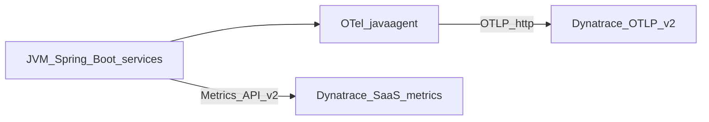

# Dynatrace direct export guide (Spring Boot 3.0.9 — OTLP traces, Micrometer metrics, Docker Compose)

This document describes the repository’s **direct-to-Dynatrace** path for **traceability-monitoring-spring-boot-3** while keeping **`spring-boot-starter-parent` 3.0.9** (same pin as the rest of the repo — **no Spring Boot upgrade** for this mode).

**Repository versions** (authoritative: root `pom.xml`, `infra/otel/install-agent.sh`): Spring Boot **3.0.9**, Java **17**, Spring Cloud BOM **2022.0.5**, parent artifact **commerce-poc-parent 0.1.0-SNAPSHOT**, OpenTelemetry Java agent **v2.1.0** (the version downloaded by the install script unless you change it).

**Recommended direct-export approach:**

| Layer | Role in this mode |
|--------|------------------|
| **OpenTelemetry Java agent** | **Distributed traces** exported over **OTLP HTTP/protobuf** to Dynatrace (`/api/v2/otlp`). Wired in **`docker-compose.yml`** (**§4.3**, **§6**). **`OTEL_METRICS_EXPORTER=none`** so **metrics** are not double-sent; use **Micrometer** only. |
| **Application metrics** | **`micrometer-registry-dynatrace`** + **`management.dynatrace.metrics.export.*`** in **`config-repo/application-dynatrace.yml`** (**§5.2**). Token scope **`metrics.ingest`** (**§2.1**). |

### Direct-export stack (OTLP traces + Micrometer metrics)



1. **OTel Java agent** — **`JAVA_TOOL_OPTIONS`** loads **`opentelemetry-javaagent.jar`** from **`./infra/otel/agent`** (run **`./infra/otel/install-agent.sh`** once). **`OTEL_EXPORTER_OTLP_*`** targets **`${DT_OTLP_ENDPOINT}`** with **`Authorization=Api-Token ${DT_OTLP_TRACE_TOKEN}`** (scope **`openTelemetryTrace.ingest`**). Per-service **`OTEL_SERVICE_NAME`** matches Spring app names.
2. **Micrometer** — **application metrics** to the **Metrics ingest API** using **`DYNATRACE_API_TOKEN`** with scope **`metrics.ingest`** (**§5.2**). **`v2.enrich-with-dynatrace-metadata: true`** helps Dynatrace correlate series with topology.

**Success criteria:** **Java services** show **distributed traces** from **OTLP** (W3C-aligned, gateway → services → messaging where instrumented) and **`commerce.poc*`** metrics from Micrometer in Dynatrace.

**Security:** never commit real tokens. Use a **gitignored** `.env` file and placeholders in **`.env.example`**.

### Running Dynatrace direct export

1. **Docker** — Install [Docker Desktop](https://www.docker.com/products/docker-desktop/) or Docker Engine; ensure the daemon is running.
2. **`.env` at repo root** — `DT_ENVIRONMENT_ID`, `DYNATRACE_API_TOKEN`, `DT_OTLP_ENDPOINT`, `DT_OTLP_TRACE_TOKEN` (see **§3**).
3. **Agent JAR** — run **`./infra/otel/install-agent.sh`** so **`./infra/otel/agent/opentelemetry-javaagent.jar`** exists (same bind mount as **`docker compose up`**).
4. **Start the stack:**  
   `docker compose up -d --build`
5. **Expectations:** **Micrometer → Dynatrace** is usually the easiest to validate. **OTLP traces** need a valid **`openTelemetryTrace.ingest`** token and reachable **`DT_OTLP_ENDPOINT`**.

---

## 1. Dynatrace environment and endpoints

Replace `YOUR_ENVIRONMENT_ID` with your tenant id (example: `kwy14669`).

| Item | URL / value |
|------|-------------|
| Environment UI | `https://YOUR_ENVIRONMENT_ID.live.dynatrace.com` |
| Metrics ingest (v2) | `https://YOUR_ENVIRONMENT_ID.live.dynatrace.com/api/v2/metrics/ingest` |
| OTLP ingest base (traces) | `https://YOUR_ENVIRONMENT_ID.live.dynatrace.com/api/v2/otlp` (set as **`DT_OTLP_ENDPOINT`**) |

---

## 2. Tokens you need

### 2.1 Application telemetry (OTLP traces + Micrometer metrics)

**Micrometer → Metrics API** — create an environment access token with scope **`metrics.ingest`**. Store as **`DYNATRACE_API_TOKEN`** (used in **`application-dynatrace.yml`** for `api-token`).

**OpenTelemetry Java agent → OTLP traces** — create a **separate** token with scope **`openTelemetryTrace.ingest`**. Store as **`DT_OTLP_TRACE_TOKEN`**. Set **`DT_OTLP_ENDPOINT`** to your tenant OTLP base URL, for example **`https://YOUR_ENVIRONMENT_ID.live.dynatrace.com/api/v2/otlp`** (adjust host if your tenant uses a different Dynatrace SaaS domain).

---

## 3. Root `.env` (gitignored) — template

Create `./.env` at the repo root. **Do not commit.**

```bash
# --- Dynatrace SaaS (Micrometer metrics API) ---
DT_ENVIRONMENT_ID=YOUR_ENVIRONMENT_ID
DYNATRACE_API_TOKEN=dt0c01.YOUR_SECRET_TOKEN

# --- OTLP traces (OpenTelemetry Java agent → Dynatrace; scope openTelemetryTrace.ingest) ---
DT_OTLP_ENDPOINT=https://YOUR_ENVIRONMENT_ID.live.dynatrace.com/api/v2/otlp
DT_OTLP_TRACE_TOKEN=dt0c01.YOUR_OTLP_TRACE_TOKEN
```

Extend **`.env.example`** with the same variable **names** only (no secrets).

---

## 4. Spring Boot 3.0.9 — Maven dependencies and trace paths

Add to each JVM service that should push **metrics** to Dynatrace (e.g. `api-gateway`, `order-service`, `inventory-service`, …):

```xml
<!-- Metrics → Dynatrace Metrics API v2 (supported on Spring Boot 3.0.9) -->
<dependency>
  <groupId>io.micrometer</groupId>
  <artifactId>micrometer-registry-dynatrace</artifactId>
  <scope>runtime</scope>
</dependency>
```

The repo may include **`micrometer-tracing-bridge-otel`** for Spring Observability / MDC. With **OTLP traces (§4.3)**, log **`traceId` / `spanId`** align with the **OpenTelemetry**-instrumented path. Avoid enabling a **second** OTLP trace exporter alongside the javaagent (**§5.3**).

Optional:

```xml
<dependency>
  <groupId>io.micrometer</groupId>
  <artifactId>context-propagation</artifactId>
</dependency>
```

Versions come from the **Spring Boot 3.0.9 BOM**; do not invent versions.

### 4.1 How traces reach Dynatrace in this mode

For **`docker compose up`**, each JVM service loads the **OpenTelemetry Java agent** and exports spans with **OTLP HTTP/protobuf** to Dynatrace (**§4.3**). That is the trace pipeline this repository documents for the Dynatrace compose path.

### 4.2 RabbitMQ (Spring Cloud Stream) — linking HTTP → message → consumer

For **Micrometer / W3C `traceparent`** to cross the broker, the stack needs:

1. **`spring-cloud-stream-binder-rabbit`’s `ObservationAutoConfiguration`** (already on the classpath with the Rabbit binder) — it turns on **`RabbitTemplate` + listener `observationEnabled`** when Boot’s **`ObservationAutoConfiguration`** is active (requires **`spring-boot-starter-actuator`** + **`micrometer-tracing-bridge-otel`** on producing/consuming services).
2. **`spring.integration.management.observation-patterns`** in **`config-repo/application.yml`** — so Spring Integration channels used by Stream participate in observations (otherwise context can drop inside `StreamBridge` internals).
3. **`ReactorContextPropagationListener`** in **`commons`** (registered via **`META-INF/spring/...ApplicationListener`**) — calls **`Hooks.enableAutomaticContextPropagation()`** when **`reactor-core`** is present so Reactor-driven hops do not lose the current **`Observation`**.

The above is what makes **application-level** Micrometer tracing consistent with Spring’s documented Rabbit + Stream behavior. **OTLP traces (§4.3)** use the OTel agent’s instrumentation and W3C propagation where the agent supports it.

---

### 4.3 Primary (Option A): **OpenTelemetry Java agent → Dynatrace OTLP** (HTTP/protobuf)

**Spring Boot 3.0.9** does not expose **`management.otlp.tracing`**; this repo sends **traces** with the **OpenTelemetry Java agent** and **`OTEL_*`** environment variables (see **`docker-compose.yml`**).

1. **Install the agent JAR** (once): **`./infra/otel/install-agent.sh`** — produces **`./infra/otel/agent/opentelemetry-javaagent.jar`** (same as the default local Jaeger stack).
2. **Compose** mounts **`./infra/otel/agent:/opt/otel:ro`** and sets **`JAVA_TOOL_OPTIONS=-javaagent:/opt/otel/opentelemetry-javaagent.jar`** plus:
   - **`OTEL_EXPORTER_OTLP_ENDPOINT=${DT_OTLP_ENDPOINT}`** — base URL ending in **`/api/v2/otlp`** for SaaS (see Dynatrace **OpenTelemetry** ingest docs for your deployment type).
   - **`OTEL_EXPORTER_OTLP_PROTOCOL=http/protobuf`** — Dynatrace OTLP is **HTTP/protobuf**, not gRPC **`4317`** to the local collector.
   - **`OTEL_EXPORTER_OTLP_HEADERS=Authorization=Api-Token ${DT_OTLP_TRACE_TOKEN}`** — token with **`openTelemetryTrace.ingest`**.
   - **`OTEL_TRACES_EXPORTER=otlp`**, **`OTEL_METRICS_EXPORTER=none`**, **`OTEL_LOGS_EXPORTER=none`** — metrics stay on **Micrometer** (**§5.2**); avoids duplicate metric pipelines.
   - **`OTEL_SERVICE_NAME`** per service (`api-gateway`, `order-service`, …).
3. **Validate** in Dynatrace **Distributed traces** / OpenTelemetry service names. If ingest fails, confirm the OTLP URL, token scope, and that the agent file exists inside the container.
4. **Log correlation:** each JSON line includes **`traceId` / `spanId`** from **Micrometer** MDC (Spring Observation + `micrometer-tracing-bridge-otel`) and **`otelTraceId` / `otelSpanId`** from the **OpenTelemetry Java agent** MDC (`trace_id` / `span_id`) when the agent is attached. **Dynatrace** shows spans exported by the **agent** — if **`traceId`** does not match the trace id in Dynatrace, use **`otelTraceId`** for correlation (Micrometer and the agent are not fully unified; see [OTel issue #7576](https://github.com/open-telemetry/opentelemetry-java-instrumentation/issues/7576)). Fields are emitted in **`logback-spring.xml`** in **commons**.

---

## 5. Spring configuration (`dynatrace` profile) — via Config Server

### 5.1 Where the YAML lives

Config Server serves **`file:///workspace/config-repo`**, bind-mounted from **`./config-repo`** (see [`docker-compose.yml`](../docker-compose.yml) and [`services/config-server/src/main/resources/application.yml`](../services/config-server/src/main/resources/application.yml)).

1. Add **`config-repo/application-dynatrace.yml`**.
2. For Dynatrace direct export runs, set on each participating service:

   **`SPRING_PROFILES_ACTIVE=cloud,dynatrace`**

Spring Cloud Config merges `application.yml`, **`application-dynatrace.yml`**, and each **`{application}.yml`** in the usual order.

### 5.2 `config-repo/application-dynatrace.yml` — **authoritative sample for Boot 3.0.9**

This file configures **metrics + log pattern**. **Distributed traces** for the direct-export Dynatrace Compose come from **§4.3** (OpenTelemetry Java agent → OTLP), not from properties in this file.

Property names match [Spring Boot 3.0.9 — Dynatrace (Actuator metrics)](https://docs.spring.io/spring-boot/docs/3.0.9/reference/html/actuator.html#actuator.metrics-export-dynatrace).

```yaml
# config-repo/application-dynatrace.yml — profile: dynatrace
management:
  dynatrace:
    metrics:
      export:
        enabled: true
        uri: "https://${DT_ENVIRONMENT_ID}.live.dynatrace.com/api/v2/metrics/ingest"
        api-token: "${DYNATRACE_API_TOKEN}"
        step: 30s
        v2:
          metric-key-prefix: "commerce.poc"
          enrich-with-dynatrace-metadata: true

logging:
  pattern:
    level: "%5p [${spring.application.name:},%X{traceId:-},%X{spanId:-}]"
```

**Do not** add `management.otlp.tracing` here — it is **not** supported on **Spring Boot 3.0.9**.

### 5.3 Avoid duplicate / conflicting tracing

- **OTLP (default overrides):** the **OpenTelemetry** `-javaagent` is on **`JAVA_TOOL_OPTIONS`** with **`OTEL_METRICS_EXPORTER=none`** so **Micrometer** remains the only metrics pipeline. **Do not** add Boot **`management.otlp.tracing`** on **3.0.9** (unsupported).
- If **`application.yml`** enables **Zipkin** export, disable it for the `dynatrace` profile so you do not add another trace exporter.

### 5.4 Fallback: per-service `application-dynatrace.yml`

Duplicate §5.2 under **`src/main/resources/application-dynatrace.yml`** per service only if Config Server cannot be used. Prefer **Config Server** (this section).

---

## 6. Docker Compose (Boot 3.0.9 + **OTLP traces**)

The root **`docker-compose.yml`** is the only maintained compose file. It starts the application stack with direct Dynatrace export enabled by default:

1. **`x-app-env`** configures Spring + Dynatrace + OTLP trace export.
2. Each JVM service sets its own **`OTEL_SERVICE_NAME`** and mounts **`./infra/otel/agent:/opt/otel:ro`**.
3. Set **`DT_ENVIRONMENT_ID`**, **`DYNATRACE_API_TOKEN`**, **`DT_OTLP_ENDPOINT`**, and **`DT_OTLP_TRACE_TOKEN`** in **`.env`** before startup.

### 6.0 Compose in this repository

| File | Role |
|------|------|
| [`docker-compose.yml`](../docker-compose.yml) | The only maintained compose file. Starts the application stack and sends traces directly to Dynatrace. |

```bash
docker compose config   # optional: validate merge
docker compose up -d --build
```

### 6.1 JVM environment — **Dynatrace direct export** (`app-env`)

**Shared JVM environment** (anchor **`app-env`**):

```yaml
x-app-env: &app-env
  SPRING_PROFILES_ACTIVE: "cloud,dynatrace"
  DT_ENVIRONMENT_ID: ${DT_ENVIRONMENT_ID}
  DYNATRACE_API_TOKEN: ${DYNATRACE_API_TOKEN}
  JAVA_TOOL_OPTIONS: "-javaagent:/opt/otel/opentelemetry-javaagent.jar"
  OTEL_EXPORTER_OTLP_ENDPOINT: "${DT_OTLP_ENDPOINT}"
  OTEL_EXPORTER_OTLP_PROTOCOL: "http/protobuf"
  OTEL_EXPORTER_OTLP_HEADERS: "Authorization=Api-Token ${DT_OTLP_TRACE_TOKEN}"
  OTEL_TRACES_EXPORTER: "otlp"
  OTEL_METRICS_EXPORTER: "none"
  OTEL_LOGS_EXPORTER: "none"
  OTEL_TRACES_SAMPLER: "parentbased_always_on"
  OTEL_INSTRUMENTATION_SPRING_INTEGRATION_ENABLED: "true"
  OTEL_RESOURCE_ATTRIBUTES: "service.namespace=commerce,deployment.environment=dynatrace-direct"
```

Per service, add **`OTEL_SERVICE_NAME`** (e.g. **`api-gateway`**) and **`volumes: ./infra/otel/agent:/opt/otel:ro`**.

Process naming for **OTLP** in Dynatrace follows **`OTEL_SERVICE_NAME`**.

### 6.2 Run (summary)

| Goal | Command |
|------|--------|
| **Dynatrace direct export** | `docker compose up -d --build` |

---

## 7. Generate traffic and validate in Dynatrace

1. **Distributed traces (OTLP)** — After traffic through the **API gateway**, open **Distributed traces** and filter by **`OTEL_SERVICE_NAME`** values. If empty, verify **§4.3** ( **`DT_OTLP_ENDPOINT`**, **`DT_OTLP_TRACE_TOKEN`**, agent JAR on the bind mount, **`http/protobuf`**).
2. **Metrics** — Data explorer; search for **`commerce.poc`** (Micrometer prefix from §5.2).

If **metrics** fail: **`metrics.ingest`** scope and **`DYNATRACE_API_TOKEN`** in the container. If **OTLP traces** fail: **`openTelemetryTrace.ingest`** on **`DT_OTLP_TRACE_TOKEN`**, **`DT_OTLP_ENDPOINT`**, and the agent file under **`./infra/otel/agent`**.

---

## 8. Repository files to touch (checklist)

| Area | Files |
|------|--------|
| Compose | **`docker-compose.yml`** — direct Dynatrace export is configured in the shared JVM environment and used by all application services |
| Secrets | `.env.example` — `DT_ENVIRONMENT_ID`, `DYNATRACE_API_TOKEN`, **`DT_OTLP_ENDPOINT`**, **`DT_OTLP_TRACE_TOKEN`** |
| Maven | `services/*/pom.xml` — **`micrometer-registry-dynatrace`** where missing |
| Spring | **`config-repo/application-dynatrace.yml`** — §5.2 |
| Docs | This file; [ARCHITECTURE.md](ARCHITECTURE.md) §21; [runbook.md](runbook.md) §4 |

---

## 9. Out of scope (explicit)

- **Spring Boot 3.1+ `management.otlp.tracing`** — different POC.

---

## 10. Reference links

- [Spring Boot 3.0.9 — Dynatrace metrics](https://docs.spring.io/spring-boot/docs/3.0.9/reference/html/actuator.html#actuator.metrics-export-dynatrace)
- [Access tokens](https://docs.dynatrace.com/docs/manage/identity-access-management/access-tokens-and-oauth-clients/access-tokens)
- [OpenTelemetry traces API](https://docs.dynatrace.com/docs/ingest-from/opentelemetry/getting-started/opentelemetry-traces)

---

## 11. Optional: internal plan sources

- `~/.cursor/plans/dynatrace_poc_validation_710f4207.plan.md`
- `~/.cursor/plans/dynatrace_poc_md_guide_d8e49311.plan.md`

Treat **`docs/DYNATRACE-POC.md`** as the implementation-oriented direct-export guide in this repository.
