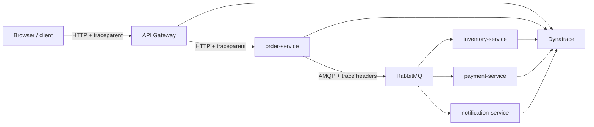

# Getting distributed traces into Dynatrace

## Goal

The goal of this document set is simple:

> **Send useful end-to-end distributed traces from the Commerce POC into Dynatrace.**

There are several valid ways to achieve that goal. This README explains the shared tracing architecture the application needs regardless of option, then compares the different implementation paths into Dynatrace.

The exporter choice is only one part of the story. To get useful **distributed traces in Dynatrace**, the whole system must cooperate:

1. each JVM service must create and propagate trace context,
2. the API gateway must preserve the active HTTP trace,
3. asynchronous broker hops such as RabbitMQ must carry context across message boundaries,
4. and one of the Dynatrace export patterns must send the resulting spans out of the process.

## Overall architecture



The final hop into Dynatrace changes by option, but the **application-side tracing requirements** are mostly the same.

## What every service needs for traces

Every participating service should have:

### 1. Spring observability enabled

At minimum, keep:

```xml
<dependency>
  <groupId>org.springframework.boot</groupId>
  <artifactId>spring-boot-starter-actuator</artifactId>
</dependency>

<dependency>
  <groupId>io.micrometer</groupId>
  <artifactId>micrometer-tracing-bridge-otel</artifactId>
</dependency>
```

In this repo, those are present on the gateway and the business services.

### 2. A stable service identity

Each JVM should emit its own service name:

```yaml
OTEL_SERVICE_NAME: "order-service"
OTEL_RESOURCE_ATTRIBUTES: "service.namespace=commerce,deployment.environment=prod"
```

That is what makes traces readable in Dynatrace instead of collapsing everything into anonymous processes.

### 3. Sampling configured intentionally

For this POC, tracing is configured to capture everything:

```yaml
management:
  tracing:
    sampling:
      probability: 1.0
```

For production, this should be revisited rather than copied blindly.

### 4. Business spans where framework spans are not enough

Framework spans tell you that a request happened. Business spans tell you **what the system was doing**.

This repo uses `@CommerceMetered(...)` around important operations such as:

- `order.place`
- `inventory.reservation`
- `payment.charge`
- notification handlers

That gives the trace a domain shape, not just an HTTP shape.

### 5. Correlated logs

The shared Logback config emits both Micrometer and OpenTelemetry trace identifiers:

```json
{
  "traceId": "...",
  "spanId": "...",
  "otelTraceId": "...",
  "otelSpanId": "..."
}
```

This is especially useful when the Java agent and Micrometer tracing contexts do not line up perfectly.

## What the API gateway needs

The gateway is the front door of the trace.

### Required behavior

- accept incoming W3C `traceparent` headers when a client sends them,
- create a new trace when no parent exists,
- propagate trace context downstream,
- expose identifiers back to the caller when useful for debugging.

This repo does that with `TracePropagationResponseHeadersFilter`, which returns:

- `X-Trace-Id`
- `X-Span-Id`
- `traceparent`

Example behavior:

```java
headers.set("X-Trace-Id", ctx.traceId());
headers.set("X-Span-Id", ctx.spanId());
headers.set("traceparent", toTraceparent(ctx));
```

That makes it easier to correlate a browser request with the same trace inside Dynatrace.

## What RabbitMQ / message brokers need

HTTP propagation is not enough for this system because the order flow continues through RabbitMQ.

To keep one trace connected across asynchronous hops, the broker path must preserve trace context on messages and restore it on consumption.

### Required pieces in this repo

#### 1. Rabbit / Stream support on the service classpath

Services that publish or consume commerce events use:

```xml
<dependency>
  <groupId>org.springframework.cloud</groupId>
  <artifactId>spring-cloud-starter-stream-rabbit</artifactId>
</dependency>
```

#### 2. Observation enabled across Spring Integration channels

```yaml
spring:
  integration:
    management:
      observation-patterns:
        - "*"
```

That setting matters because Spring Cloud Stream routes through Spring Integration channels. Without observation coverage there, trace context can disappear before the AMQP publish happens.

#### 3. Reactor context propagation enabled early

This repo uses `ReactorContextPropagationListener` to call:

```java
Hooks.enableAutomaticContextPropagation();
```

That protects trace context across Reactor thread hops used in the Stream / Rabbit flow. Without it, a producer may publish a message without the expected trace context and the consumer can start a new root trace instead of continuing the original one.

### What to validate for RabbitMQ

For the checkout saga, verify that one trace shows:

1. the gateway request,
2. the order placement work,
3. the message publish,
4. the inventory / payment consumers,
5. the notification consumer.

If you see separate unrelated traces after the broker hop, context propagation is broken even if export to Dynatrace is working.

## Ways to achieve the goal in Dynatrace

The application-side requirements above are shared. What changes between the options is **how the same end-to-end traces are delivered into Dynatrace**.

| Option | Best when | Main tradeoff |
|---|---|---|
| [1. OneAgent](oneagent.md) | You want the most Dynatrace-native experience with the least application-level telemetry wiring. | Strongest Dynatrace coupling; requires OneAgent deployment and runtime access. |
| [2. OpenTelemetry Java agent + Dynatrace direct export](otel-java-agent-direct-dynatrace.md) | You want strong automatic instrumentation with fewer moving parts than a collector pipeline. | Less flexible than a centralized collector. |
| [3. OpenTelemetry Java agent + Collector + Dynatrace](otel-java-agent-collector-dynatrace.md) | You want rich auto-instrumentation plus a vendor-neutral telemetry pipeline with central processing. | More infrastructure to run and maintain. |
| [4. Agentless custom OpenTelemetry SDK + Dynatrace](custom-sdk-dynatrace.md) | You want no runtime agent and are willing to own instrumentation in the application. | Highest engineering ownership and the easiest path to trace-coverage gaps. |

## Quick comparison

| Dimension | OneAgent | OTel Java agent direct | OTel Java agent + Collector | Custom SDK, no agent |
|---|---:|---:|---:|---:|
| Runtime agent required | Yes | Yes | Yes | No |
| Collector required | No | No | Yes | No |
| Out-of-the-box instrumentation breadth | Highest | High | High | Lowest unless you add it |
| Dynatrace-native topology/enrichment | Highest | Medium | Medium | Medium |
| Vendor portability | Low | Medium | High | High |
| App code changes | Low | Low | Low | Medium / high |
| Infrastructure to maintain | Medium | Low | Highest | Lowest |
| Fit for this Spring Boot 3.0.9 repo | Good | **Current implementation** | Good | Possible, but most work |

## How I would choose

### Choose OneAgent when
- the organization is already standardized on Dynatrace,
- you want the fastest path to broad visibility,
- and portability is less important than low app-side effort.

### Choose OTel Java agent direct export when
- Dynatrace is your only trace backend,
- you want fewer moving parts than a collector pipeline,
- and you still want broad automatic instrumentation.

### Choose OTel Java agent + Collector when
- you want OpenTelemetry as the common telemetry contract,
- you may fan out to multiple backends later,
- or you need central processing such as redaction, batching, sampling, or enrichment.

### Choose custom SDK when
- avoiding any runtime agent is a hard requirement,
- you accept narrower automatic coverage,
- and your team is willing to own instrumentation quality in code.

## Recommendation for this repository

If the only question is **“how do we get traces into Dynatrace with the least friction?”**, use **OpenTelemetry Java agent direct export** — that is the path currently implemented in this repository.

Use **OneAgent** when you want the most Dynatrace-native route to the same goal. Use **OpenTelemetry Java agent + Collector** when you still want traces in Dynatrace but also need centralized processing or future backend flexibility. Use the **custom SDK** path only when avoiding runtime agents is itself a requirement and you are willing to own the trace coverage explicitly.
