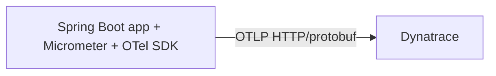

# Option 3 — Agentless custom OpenTelemetry SDK + Dynatrace

## Goal

Remove runtime agents entirely and export traces from inside the application using the **OpenTelemetry SDK**.



## When this option fits

Choose this option only when:

- avoiding a runtime agent is a hard requirement,
- you want observability behavior owned in code,
- and your team is willing to maintain instrumentation quality deliberately.

## Important constraint for this repo

This project is on **Spring Boot 3.0.9**. That makes this path possible, but less ergonomic than newer Spring Boot releases because you must assemble more of the OpenTelemetry wiring yourself.

## High-level design

Keep:

- `micrometer-tracing-bridge-otel`
- Spring Observation / `ObservationRegistry`
- custom business observations such as `@CommerceMetered`

Add:

- OpenTelemetry SDK
- OTLP exporter
- SDK auto-configuration or explicit SDK bootstrap

Remove:

- `JAVA_TOOL_OPTIONS=-javaagent:...`
- the mounted Java agent JAR

## Dependency sketch

```xml
<dependency>
  <groupId>io.opentelemetry</groupId>
  <artifactId>opentelemetry-sdk-extension-autoconfigure</artifactId>
</dependency>

<dependency>
  <groupId>io.opentelemetry</groupId>
  <artifactId>opentelemetry-exporter-otlp</artifactId>
</dependency>
```

## SDK bootstrap sketch

```java
@Configuration
public class OpenTelemetrySdkConfiguration {

  @Bean
  OpenTelemetrySdk openTelemetrySdk() {
    return AutoConfiguredOpenTelemetrySdk.builder()
        .build()
        .getOpenTelemetrySdk();
  }
}
```

## Runtime configuration

```yaml
OTEL_SERVICE_NAME: "order-service"
OTEL_EXPORTER_OTLP_ENDPOINT: "${DT_OTLP_ENDPOINT}"
OTEL_EXPORTER_OTLP_PROTOCOL: "http/protobuf"
OTEL_EXPORTER_OTLP_HEADERS: "Authorization=Api-Token ${DT_OTLP_TRACE_TOKEN}"
OTEL_TRACES_EXPORTER: "otlp"
```

## What you must validate yourself

Because there is no Java agent, you must explicitly prove that the spans you care about still exist:

- inbound HTTP requests,
- downstream HTTP calls,
- RabbitMQ producer / consumer propagation,
- JDBC visibility if you need database spans,
- custom business spans,
- log correlation.

## Pros

- No runtime agent.
- Very explicit ownership of what is traced.
- Lowest observability infrastructure footprint.
- Strong portability if you stay disciplined with OpenTelemetry APIs.

## Cons

- Highest engineering ownership.
- Easiest path to missing spans or inconsistent propagation.
- Less automatic coverage than Java-agent-based approaches.
- On Spring Boot 3.0.9, this is more work than on newer Spring Boot lines.

## Practical notes for this repo

This path is viable, but I would treat it as an intentional migration project rather than a quick configuration change.

A sensible spike would be:

1. remove the Java agent from `order-service` only,
2. add the SDK/exporter wiring,
3. generate a full checkout flow,
4. compare the Dynatrace trace before and after,
5. decide whether the loss in automatic coverage is acceptable.
