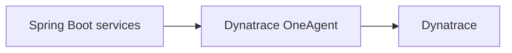

# Option 1 — Dynatrace OneAgent

## Goal

Use **Dynatrace OneAgent** as the primary instrumentation mechanism for the JVM services.



## When this option fits

Choose this option when you want:

- the most Dynatrace-native setup,
- broad automatic instrumentation with little application configuration,
- topology discovery and host/process correlation handled by Dynatrace,
- and minimal observability code inside the application.

## What you install

OneAgent is installed on the host or injected into the workload runtime depending on your deployment model.

Example environment variables you may use in Docker-style deployment flows:

```bash
ONEAGENT_INSTALLER_SCRIPT_URL=https://YOUR_ENVIRONMENT.live.dynatrace.com/api/v1/deployment/installer/agent/unix/default/latest?arch=x86
ONEAGENT_INSTALLER_DOWNLOAD_TOKEN=dt0c01.YOUR_TOKEN
ONEAGENT_ENABLE_VOLUME_STORAGE=true
```

## Application changes

Usually very few. Your services do **not** need:

```yaml
JAVA_TOOL_OPTIONS: "-javaagent:/opt/otel/opentelemetry-javaagent.jar"
OTEL_EXPORTER_OTLP_ENDPOINT: ...
```

If you keep Micrometer metrics separately, you can still publish custom business metrics to Dynatrace with:

```xml
<dependency>
  <groupId>io.micrometer</groupId>
  <artifactId>micrometer-registry-dynatrace</artifactId>
  <scope>runtime</scope>
</dependency>
```

and:

```yaml
management:
  dynatrace:
    metrics:
      export:
        enabled: true
        uri: "https://${DT_ENVIRONMENT_ID}.live.dynatrace.com/api/v2/metrics/ingest"
        api-token: "${DYNATRACE_API_TOKEN}"
```

## What you get

- strong automatic JVM visibility,
- process/service detection,
- broad framework instrumentation,
- Dynatrace-native correlation,
- low application-side configuration burden.

## Pros

- Lowest observability effort inside the codebase.
- Usually the strongest out-of-the-box Dynatrace experience.
- Good choice if your organization already runs Dynatrace everywhere.

## Cons

- Least portable of the three options.
- Requires OneAgent deployment and runtime governance.
- Harder to keep observability vendor-neutral.
- Less aligned with an OpenTelemetry-first architecture.

## Practical notes for this repo

If you choose OneAgent as the main path here:

1. remove the OpenTelemetry Java agent settings from `docker-compose.yml`,
2. decide whether to keep Micrometer-to-Dynatrace metrics for custom business metrics,
3. validate HTTP, RabbitMQ, JDBC, and service topology in Dynatrace after OneAgent is attached.
