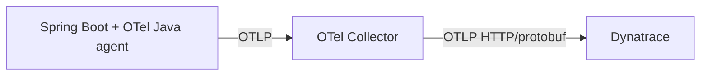

# Option 2 — OpenTelemetry Java agent + OpenTelemetry Collector + Dynatrace

## Goal

Use the **OpenTelemetry Java agent** for automatic instrumentation, route telemetry through an **OpenTelemetry Collector**, and export from the collector to **Dynatrace**.



## When this option fits

Choose this option when you want:

- rich automatic instrumentation,
- a vendor-neutral telemetry contract,
- central processing before data leaves your environment,
- future flexibility to fan out to more than one backend.

## Application-side configuration

Attach the Java agent and send telemetry to the collector:

```yaml
JAVA_TOOL_OPTIONS: "-javaagent:/opt/otel/opentelemetry-javaagent.jar"
OTEL_EXPORTER_OTLP_ENDPOINT: "http://otel-collector:4317"
OTEL_EXPORTER_OTLP_PROTOCOL: "grpc"
OTEL_TRACES_EXPORTER: "otlp"
OTEL_METRICS_EXPORTER: "none"
OTEL_LOGS_EXPORTER: "none"
OTEL_SERVICE_NAME: "order-service"
OTEL_RESOURCE_ATTRIBUTES: "service.namespace=commerce,deployment.environment=prod"
```

## Collector example

```yaml
receivers:
  otlp:
    protocols:
      grpc:
        endpoint: 0.0.0.0:4317

processors:
  batch: {}

exporters:
  otlphttp/dynatrace:
    endpoint: ${env:DT_OTLP_ENDPOINT}
    headers:
      Authorization: "Api-Token ${env:DT_OTLP_TRACE_TOKEN}"

service:
  pipelines:
    traces:
      receivers: [otlp]
      processors: [batch]
      exporters: [otlphttp/dynatrace]
```

## Compose sketch

```yaml
services:
  otel-collector:
    image: otel/opentelemetry-collector-contrib:0.96.0
    command: ["--config=/etc/otelcol/config.yaml"]
    environment:
      DT_OTLP_ENDPOINT: ${DT_OTLP_ENDPOINT}
      DT_OTLP_TRACE_TOKEN: ${DT_OTLP_TRACE_TOKEN}
    volumes:
      - ./infra/observability/otel-collector-config.yaml:/etc/otelcol/config.yaml:ro
```

## What you get

- strong automatic instrumentation from the Java agent,
- centralized control over batching, transformation, redaction, and fan-out,
- the ability to swap or add backends later without touching application code.

## Pros

- Best balance between rich coverage and vendor neutrality.
- Collector gives you a clean operational control point.
- Good fit when multiple teams or environments need consistent telemetry handling.

## Cons

- More moving parts than direct export.
- You must operate and monitor the collector.
- Slightly more latency and more configuration surface.

## Practical notes for this repo

This option is a strong fit if you want to keep the Java agent but avoid hard-wiring every service directly to Dynatrace. It is especially useful if you may later:

- send the same traces to another backend,
- add central sampling,
- redact attributes before export,
- or standardize enrichment across services.
