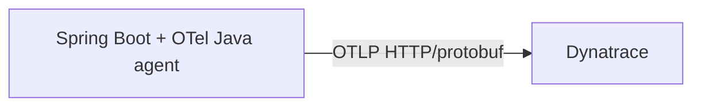

# Option 2 — OpenTelemetry Java agent + Dynatrace direct export

## Goal

Use the **OpenTelemetry Java agent** for automatic instrumentation and send traces **directly** from each JVM service to Dynatrace over OTLP.



## When this option fits

Choose this option when you want:

- strong automatic instrumentation,
- fewer moving parts than a collector-based pipeline,
- and direct Dynatrace trace export without adding observability infrastructure.

## Application-side configuration

```yaml
JAVA_TOOL_OPTIONS: "-javaagent:/opt/otel/opentelemetry-javaagent.jar"
OTEL_EXPORTER_OTLP_ENDPOINT: "${DT_OTLP_ENDPOINT}"
OTEL_EXPORTER_OTLP_PROTOCOL: "http/protobuf"
OTEL_EXPORTER_OTLP_HEADERS: "Authorization=Api-Token ${DT_OTLP_TRACE_TOKEN}"
OTEL_TRACES_EXPORTER: "otlp"
OTEL_METRICS_EXPORTER: "none"
OTEL_LOGS_EXPORTER: "none"
OTEL_SERVICE_NAME: "order-service"
OTEL_RESOURCE_ATTRIBUTES: "service.namespace=commerce,deployment.environment=prod"
```

For Dynatrace SaaS, `DT_OTLP_ENDPOINT` typically looks like:

```bash
https://YOUR_ENVIRONMENT_ID.live.dynatrace.com/api/v2/otlp
```

## Compose sketch

```yaml
x-app-env: &app-env
  JAVA_TOOL_OPTIONS: "-javaagent:/opt/otel/opentelemetry-javaagent.jar"
  OTEL_EXPORTER_OTLP_ENDPOINT: "${DT_OTLP_ENDPOINT}"
  OTEL_EXPORTER_OTLP_PROTOCOL: "http/protobuf"
  OTEL_EXPORTER_OTLP_HEADERS: "Authorization=Api-Token ${DT_OTLP_TRACE_TOKEN}"
  OTEL_TRACES_EXPORTER: "otlp"
  OTEL_METRICS_EXPORTER: "none"
  OTEL_LOGS_EXPORTER: "none"

services:
  order-service:
    environment:
      <<: *app-env
      OTEL_SERVICE_NAME: "order-service"
    volumes:
      - ./infra/otel/agent:/opt/otel:ro
```

## What you get

- automatic instrumentation from the Java agent,
- no collector to deploy or operate,
- direct delivery of traces into Dynatrace,
- lower infrastructure complexity than the collector-based pattern.

## Pros

- Simpler than running a collector.
- Stronger out-of-the-box coverage than an agentless SDK-only approach.
- Good fit when Dynatrace is the only trace backend you need.
- This is the architecture currently implemented in this repository.

## Cons

- Less flexible than a collector-based pipeline.
- Each service is coupled directly to the Dynatrace endpoint and auth configuration.
- Harder to fan out telemetry to another backend later without touching app deployment config.
- Still requires a runtime Java agent.

## Practical notes for this repo

This is the **current implementation** in `docker-compose.yml`:

- the Java agent is attached through `JAVA_TOOL_OPTIONS`,
- the OTLP endpoint points directly to Dynatrace,
- metrics remain on Micrometer rather than OTLP metrics,
- and no collector is required.
