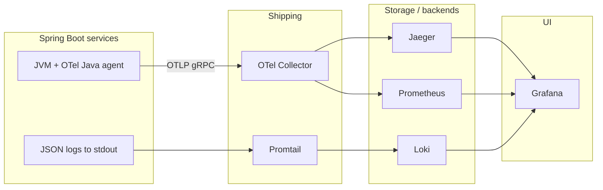

# Observability stack primer — for developers new to OpenTelemetry, Grafana, Loki, and Promtail

This document explains the **ideas** behind the tools used in the Commerce POC and how they fit together locally. It complements the **[runbook](runbook.md)** (URLs and day‑to‑day queries) and **[ARCHITECTURE.md](ARCHITECTURE.md)** (system design).

---

## 1. Why so many moving parts?

Microservices generate **three classic signals**:

| Signal | Question it answers | In this POC |
|--------|---------------------|-------------|
| **Metrics** | How much / how fast? (rates, errors, latency) | Prometheus scrapes Spring Boot **Actuator** (and OTel metrics via the Collector). **Grafana** charts them. |
| **Logs** | What happened in plain language? | Apps print **JSON** to stdout; **Promtail** ships lines to **Loki**; **Grafana** searches them. |
| **Traces** | Which services participated in one request? | **OpenTelemetry** collects spans; the **OTel Collector** forwards traces to **Jaeger**; **Grafana** can open Jaeger traces too. |

You do **not** need to memorize every product. Treat them as a pipeline: **instrument → collect → store → visualize/query**.

---

## 2. OpenTelemetry (OTel) — portable instrumentation

**What it is:** A **vendor-neutral** standard (APIs + wire protocol **OTLP**) for traces, metrics, and logs. You describe telemetry once; backends (Jaeger, Prometheus, Grafana Cloud, commercial APM, etc.) consume OTLP or converted formats.

**Two common patterns:**

1. **Auto‑instrumentation (Java agent)** — A JVM `-javaagent` attaches to your process and instruments frameworks (HTTP, JDBC, messaging, etc.) with **no code changes**. This POC uses that approach.
2. **Manual instrumentation** — You call the OTel API in code for custom spans or baggage. Used sparingly here; business metrics often use **Micrometer** instead.

**Concepts:**

- **Span** — One timed operation (for example “HTTP GET /orders/{id}”).
- **Trace** — A tree of spans linked by IDs (a whole checkout flow across services).
- **Exporter** — Sends spans/metrics out of the process (here: **OTLP gRPC** to the Collector).
- **Collector** — A separate process that **receives** OTLP, processes batches, and **re‑exports** to Jaeger, Prometheus scrape endpoints, etc.

**In this repo:**

- Script: `infra/otel/install-agent.sh` downloads `infra/otel/agent/opentelemetry-javaagent.jar`.
- Compose mounts that folder at `/opt/otel` on **Spring Boot** services and sets `JAVA_TOOL_OPTIONS` to load the agent (see root `docker-compose.yml`).
- Collector config: `infra/observability/otel-collector-config.yaml` (traces → Jaeger OTLP; metrics exposed for Prometheus).

**Sample mental check:** After placing an order, open **Jaeger** (`http://localhost:16686`), pick service **`api-gateway`**, click **Find Traces**. You should see a trace involving downstream services — that graph is built from OTel spans.

---

## 3. Grafana — one UI for dashboards and ad‑hoc queries

**What it is:** A web front end that connects to **data sources** (Prometheus, Loki, Jaeger, etc.), runs queries you write or that dashboards embed, and renders charts and tables.

**Two modes developers use most:**

1. **Dashboards** — Prebuilt pages with panels (graphs, stats, log widgets). This POC provisions JSON from `infra/observability/grafana/dashboards/` (for example **Commerce — Orders**, **Commerce — ERROR logs**).
2. **Explore** — Pick a datasource (Prometheus / Loki / Jaeger), write a query, inspect raw series or log lines. Ideal when debugging something new.

**Datasources in this project** are wired in `infra/observability/grafana/provisioning/datasources/datasources.yaml`:

| Datasource | UID | Points at |
|------------|-----|-----------|
| Prometheus | `prometheus` | `http://prometheus:9090` |
| Loki | `loki` | `http://loki:3100` |
| Jaeger | `jaeger` | `http://jaeger:16686` |

Jaeger is configured with **traces-to-logs**: from a span you can jump into Loki using the trace id (substring match on JSON logs).

**Sample:** Log into Grafana (`http://localhost:3000`), go to **Explore**, choose **Loki**, paste a LogQL query from section 8 below, adjust the time range (top right), click **Run query**.

---

## 4. Loki — log storage optimized for labels, not full‑text indexing everywhere

**What it is:** A log aggregation system (often paired with Grafana). You send **log streams** with **labels** (key/value pairs attached per stream). Loki indexes **labels**, not every word in every log line — that keeps cost down compared to classic ELK-style indexing.

**Implication:** High‑cardinality fields (unique trace id per request, user id, order id) must **not** become Loki labels in production; they blow up memory and cost. Instead, keep them **inside the log line** (for example JSON fields) and parse at query time.

**In this POC:**

- Apps emit **one JSON object per line** (see `services/commons/src/main/resources/logback-spring.xml`).
- Fields like `traceId`, `spanId`, `orderId`, `level`, `message` live **in the JSON**.
- Promtail only adds coarse labels `service` and `container` (Docker Compose service name), which are safe cardinality.

**Query language:** **LogQL** — selector on labels first, then optional pipelines (`| json`, filters, etc.).

---

## 5. Promtail — tail Docker logs and push to Loki

**What it is:** Grafana’s **log shipper**. It discovers Docker containers (via the Docker socket), reads their stdout/stderr log files, attaches labels, and **pushes** batches to Loki’s HTTP API.

**Why it exists:** Applications should keep logging to stdout; Promtail **centralizes** shipping without changing Java code for remote syslog or vendor agents.

**In this repo:**

- Config: `infra/observability/promtail-config.yaml`.
- Compose service **`promtail`** mounts `/var/run/docker.sock` and `/var/lib/docker/containers` read‑only, and sends to `http://loki:3100/loki/api/v1/push`.

**Sample mental check:** If **Explore → Loki** returns `{service="order-service"}` lines after an API call, Promtail is successfully scraping that container.

---

## 6. How the pieces connect (Commerce POC)



---

## 7. Java: how spans, traces, and metrics are collected

In this POC, **three mechanisms stack**:

| Mechanism | Role |
|-----------|------|
| **OpenTelemetry Java agent** (`-javaagent`, see `docker-compose.yml`) | Auto‑instruments frameworks (HTTP inbound/outbound, messaging, JDBC, …), creates **spans**, propagates context, exports **OTLP** to the Collector. |
| **Micrometer Observation** + **`micrometer-tracing-bridge-otel`** | Bridges Spring’s **Observation** API to **OTel spans** (nested observations → related scopes / child spans). HTTP MVC registers an observation per request automatically. |
| **`MeterRegistry`** (Micrometer) | **Counters** and **timers** derived from observations plus hand‑written counters; exposed at **`/actuator/prometheus`**. |

**Trace** = tree of **spans** sharing a trace id. **Metrics** = orthogonal time series (rates, histograms) scraped by Prometheus; they do not replace traces.

### 7.1 Automatic: one HTTP request → span(s) + trace context

You normally write **no code** for the inbound REST span. Spring Boot registers an observation for the MVC exchange; the OTel agent and tracing bridge associate it with exportable spans and put **`traceId` / `spanId`** into SLF4J MDC so JSON logs correlate with Jaeger.

### 7.2 Nested observation (custom span + latency histogram) — `@CommerceMetered`

Business methods use **`@CommerceMetered("some.metric.suffix")`**. The aspect in **`CommerceMeteredAspect`** wraps the method in an **`Observation`** so you get:

- A **timer** (Prometheus: `*_seconds_*` under the observation name, e.g. `commerce_order_service_order_place_seconds_*`).
- **Span linkage** under the active trace while `observation.openScope()` is open (when a request or message handler already started tracing).

Core pattern (abbreviated from `services/commons/.../CommerceMeteredAspect.java`):

```java
Observation observation =
    Observation.createNotStarted(name, observationRegistry);
observation.start();
MeteredOutcomes.push(new MeteredOutcomes.Context(name, meterRegistry, observation));
try (var ignored = observation.openScope()) {
  return pjp.proceed(); // your @CommerceMetered method body
} catch (Throwable ex) {
  observation.error(ex);
  throw ex;
} finally {
  MeteredOutcomes.pop();
  observation.stop();
}
```

### 7.3 Outcome counters + tags on the active observation — `MeteredOutcomes`

Inside a **`@CommerceMetered`** method, **`MeteredOutcomes.outcome("found")`** (or another label value) increments a **Micrometer counter** named like **`commerce_{service}_{suffix}_total`** and attaches a **`result`** tag on the **current** observation. Example from **`PlaceOrderService.find`** / lookup metrics:

```java
MeteredOutcomes.outcome("not_found");
throw new NoSuchElementException();
// or
MeteredOutcomes.outcome("found");
return cachedOrLoaded;
```

Prometheus sees something like **`commerce_order_service_order_lookup_total{result="found|not_found",...}`**.

### 7.4 Marking the HTTP span when you map an exception to HTTP 4xx — `ObservationRegistry`

Controllers may throw exceptions that are converted to **Problem Detail** responses. **`OrderWebExceptionHandler`** still marks the **active HTTP observation** as failed so the trace shows **ERROR** (useful in Jaeger) even when the client receives a normal **404**:

```java
Observation obs = observationRegistry.getCurrentObservation();
if (obs != null) {
  obs.error(ex);
  obs.highCardinalityKeyValue("commerce.http.error", errorCode);
  obs.event(Observation.Event.of(errorCode));
}
```

(See `services/order-service/.../OrderWebExceptionHandler.java`.)

### 7.5 Plain counters (no Observation) — `MeterRegistry`

Legacy or auxiliary counters bypass **`Observation`** and register directly. Example from **`ChargePaymentConsumer`**:

```java
Counter.builder("payments.successful.count")
    .description("Number of successful payments")
    .register(meterRegistry);
// ...
successCounter.increment();
```

Those appear as **`payments_successful_count_total`** on **`/actuator/prometheus`** with your global **`application`** tag (`management.metrics.tags` in `config-repo/application.yml`).

### 7.6 Manual one‑shot observation (idiom)

Without AOP, the same “start → scope → stop” shape can be written inline:

```java
Observation.createNotStarted("commerce.my_service.custom.step", observationRegistry)
    .observe(() -> doStep());
```

Prefer **`@CommerceMetered`** in this repo so naming stays consistent with **`CommerceMeterNames`**.

---

## 8. Copy‑paste samples

Replace placeholders such as `<trace-id>` and `<order-uuid>` with real values from Jaeger or the UI.

### 8.1 LogQL (Grafana → Explore → Loki)

**All logs from one Compose service:**

```logql
{service="order-service"}
```

**Parse JSON and keep only ERROR lines (same idea as the ERROR dashboard):**

```logql
{service=~"order-service|inventory-service|payment-service"}
  | json
  | level="ERROR"
```

**Follow one distributed trace across services (trace id from Jaeger):**

```logql
{service=~".+"} | json | traceId="<trace-id>"
```

**Logs that mention a specific order id (UUID in MDC):**

```logql
{service=~".+"} | json | orderId="<order-uuid>"
```

**Substring fallback** (works even if `| json` is picky about field names — Jaeger “Related logs” uses this style):

```logql
{service=~".+"} |= "<trace-id>"
```

### 8.2 PromQL (Grafana → Explore → Prometheus)

**Rate of placed orders (counter exposed by Micrometer as `orders_placed_count_total`):**

```promql
sum(rate(orders_placed_count_total{application="order-service"}[5m]))
```

**Order lookup outcomes (`found` vs `not_found`):**

```promql
sum by (result) (
  rate(commerce_order_service_order_lookup_total{application="order-service"}[5m])
)
```

**Redis order‑detail cache hits vs misses:**

```promql
sum by (result) (
  rate(commerce_order_service_order_detail_cache_total{application="order-service"}[5m])
)
```

### 8.3 Prometheus UI (no Grafana)

Open `http://localhost:9090` → **Graph** → paste the same PromQL as above → **Execute**.

### 8.4 Jaeger

1. `http://localhost:16686`
2. Select **Service** (try `api-gateway` or `order-service`).
3. **Find Traces** → open a trace → use **Related Logs** (if configured) or copy **Trace ID** into the LogQL samples above.

---

## 9. Pitfalls that confuse newcomers

1. **Duplicate `traceId` vs `trace_id` (and spans)** — **Micrometer tracing** puts **`traceId`** / **`spanId`** in SLF4J MDC for log correlation. The **OpenTelemetry Java agent** often adds **`trace_id`** / **`span_id`** too (OpenTelemetry naming). Both refer to the same trace; Logback was emitting both until `logback-spring.xml` excluded the snake_case keys from the `<mdc/>` provider so Grafana/Jaeger samples stay on camelCase.

2. **“I filtered `traceId` in Loki labels”** — In this POC, trace id is **inside JSON**, not a Loki label. Start with `{service=~"..."}` then `| json | traceId="..."`.

3. **“Promtail = OpenTelemetry”** — Different paths: OTel handles **traces/metrics** from the JVM; Promtail handles **log files** from Docker. Both end up visible in Grafana.

4. **“Grafana stores my logs”** — Grafana primarily **queries** Loki/Prometheus/Jaeger; long‑term retention is configured on those backends (this POC uses simple local volumes).

---

## 10. Where to read next

| Topic | Location |
|-------|----------|
| URLs, credentials, teardown | [runbook.md](runbook.md) |
| Saga flow, Compose excerpt, migration | [ARCHITECTURE.md](ARCHITECTURE.md) |
| Happy paths, failures, cache & idempotency | [scenarios-and-edge-cases.md](scenarios-and-edge-cases.md) |
| Order cache & metrics detail | [architecture/order-service.md](architecture/order-service.md) |
| Loki datasource & derived fields | `infra/observability/grafana/provisioning/datasources/datasources.yaml` |
| Promtail scrape rules | `infra/observability/promtail-config.yaml` |
