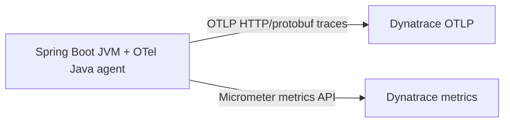

# Observability primer — Dynatrace direct export

This repository now maintains one observability path:



## What each piece does

| Piece | Role |
|---|---|
| OpenTelemetry Java agent | Auto-instruments HTTP, JDBC, messaging, and other supported libraries, then exports spans directly to Dynatrace. |
| Micrometer | Publishes application and JVM metrics directly to Dynatrace. |
| Dynatrace | Stores and analyzes traces and metrics. |

## Why there is no collector here

An OpenTelemetry Collector is useful when you need buffering, transformation, fan-out, or vendor-neutral routing. This repo no longer maintains that extra layer because the chosen scope is direct export to Dynatrace.

## Key runtime settings

```yaml
OTEL_EXPORTER_OTLP_ENDPOINT: "${DT_OTLP_ENDPOINT}"
OTEL_EXPORTER_OTLP_PROTOCOL: "http/protobuf"
OTEL_EXPORTER_OTLP_HEADERS: "Authorization=Api-Token ${DT_OTLP_TRACE_TOKEN}"
OTEL_TRACES_EXPORTER: "otlp"
OTEL_METRICS_EXPORTER: "none"
```

Metrics stay on Micrometer, so OTLP metrics remain disabled to avoid duplicate pipelines.
